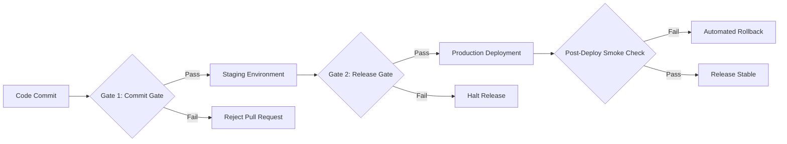

# Chapter 01: Quality Engineering Strategy & Delivery Risk Model

## 1.1 Core Quality Invariants (The Agile Guardrails)

Development velocity MUST NOT be blocked by heavy manual processes or bureaucratic approvals. Automated Quality Guardrails MUST be established and integrated directly into the delivery workflow within CI/CD Pipelines in GitHub Actions. If a Pull Request (PR) fails any of these Quality Gates or Guardrails, the Build MUST be blocked automatically.

### 1.1.1 Web Accessibility (Shift-Left UI Compliance)

Accessibility MUST be managed as a continuous Quality Gate in the Frontend Build, eliminating post-release manual audits. Shifting accessibility checks left prevents design and requirements defects in early stages, reducing remediation costs in later phases.

- **The Guardrail:** Critical Business Journeys and shared UI components MUST pass automated accessibility checks via `@axe-core/playwright` during Pipeline execution.
    
- **Robust Locators:** To prevent fragile Test Suites that break with volatile HTML updates, Engineering Teams MUST exclusively use user-accessible semantic locators:


```TypeScript
// Enforced: Relies on accessibility tree roles, emulating human interaction
await page.getByRole('button', { name: 'Confirm Payment' }).click();

// Prohibited: Fragile locator prone to failure upon UI refactoring
await page.locator('.btn-primary >> xpath=//div[2]/button').click();
```

### 1.1.2 Data Privacy (Zero PII in Lower Environments)

Actual production data MUST NOT be used in lower environments without approved anonymization controls under any circumstances. This constraint eliminates regulatory non-compliance risks and data security breaches across the application infrastructure.

- **Data Masking & Data Subsetting:** All Test Datasets derived from production sources MUST be processed through an automated Pipeline featuring Data Masking, Data Subsetting, and Tokenization. Synthetic data MUST be used to replace emails, names, and user financial details while maintaining referential integrity across databases.
    
- **Log & Observability Leakage Prevention:** Automated Integration Testing and Contract Testing suites MUST actively validate that no Personally Identifiable Information (PII) is written in plain text inside application Logs, APM Traces, or telemetry attributes, nor exposed within URL Query Parameters.
    

### 1.1.3 Zero-Trust API & Network Security

Authentication security MUST rely exclusively on approved identity protocols and secure transport mechanisms. Client applications MUST NOT be considered a Trusted Security Boundary.

Automation Suites MUST enforce network and perimeter security by validating:

- Mandatory redirection to HTTPS/TLS 1.3 and injection of secure transport headers (`Strict-Transport-Security`).
    
- **RBAC Boundary Isolation:** Automated API tests MUST validate authorization boundaries using different authenticated user contexts (OAuth2/OIDC or application identity mechanisms) to actively attempt cross-user (Cross-User) and cross-tenant (Cross-Tenant) accesses. This directly protects against Broken Object Level Authorization (BOLA) vulnerabilities and unauthorized state-changing operations across data ownership boundaries.
    

## 1.2 Pragmatic Risk-Based Testing (RBT)

Fast-growing scaleups MUST NOT attempt to automate 100% of test cases; doing so is an anti-pattern that introduces high maintenance overhead and causes test suite exhaustion over time (The Pesticide Paradox). Engineering resources MUST be prioritized using an agile Product Risk Matrix based on business impact (Blast Radius) and technical instability (Technical Instability).

```
                 [ HIGH BLAST RADIUS ]
  Minimal Automation /   |   100% Automated E2E
  Exploratory Testing    |   & Regression Suites
                         |
[ LOW INSTABILITY ] -----+----- [ HIGH INSTABILITY ]
                         |
  Unit Tests Only /      |   Smoke Tests /
  Ad-hoc Checks          |   Component Automation
                 [ LOW BLAST RADIUS ]
```

### 1.2.1 Pragmatic Risk Calibration (The 5-Minute Heuristic)

To eliminate analysis paralysis during Sprint Planning, complex mathematical equations SHOULD be avoided. Tech Leads and QA engineers MUST evaluate features using a rapid binary-trend matrix combining two real engineering factors:

1. **Technical Instability (Failure Likelihood):** Evaluates code volatility. High code churn, legacy technical debt, or complex distributed microservices = High; standard CRUD operations or static endpoints = Low.
    
2. **Blast Radius (Business Impact):** Evaluates financial or legal impact upon failure. Payment blocking, PII leakage, or onboarding disruption = High; minor visual bugs or analytics delays = Low.
    

Features MUST be mapped instantly into three actionable Tiers to define immediate automation commitments:

```
		               [ BLAST RADIUS ]
		         Low       Medium       High
		     +-----------+-----------+-----------+
		High |  TIER 1   |  TIER 1   |  TIER 1   |
TECH    -----+-----------+-----------+-----------+
INSTAB   Med |  TIER 3   |  TIER 2   |  TIER 1   |
		-----+-----------+-----------+-----------+
		 Low |  TIER 3   |  TIER 3   |  TIER 2   |
		     +-----------+-----------+-----------+
```

### 1.2.2 Automation & Coverage Strategy Mapping

> **Note:** The Automation Confidence Targets indicated below apply strictly to automated assertions within assigned scopes, not to absolute business functionality or generic code line coverage KPIs.

|**Engineering Priority**|**Automation Confidence Target**|**CI Automation Gate**|**Core Strategy**|
|---|---|---|---|
|**Tier 1 (Critical)**<br><br>  <br>  <br><br>High Blast Radius / High Instability|$\ge 90\%$|**Blocking Gate**<br><br>  <br>  <br><br>_(PR merge is blocked if tests fail)_|Automated E2E User Journeys, strict API Contract Testing validation, and UI accessibility scans.|
|**Tier 2 (High/Medium)**<br><br>  <br>  <br><br>Moderate Risk / Volatile features|$\ge 70\%$|**Warning Gate**<br><br>  <br>  <br><br>_(Alerts the team but allows PR merge)_|Component-level UI Integration Testing, isolated API Endpoint validations, and dynamic security boundary tests.|
|**Tier 3 (Low)**<br><br>  <br>  <br><br>Internal tools / Minimal impact|Unit / Smoke Only|**No Gate Block**|Execution of basic Unit Tests and high-level generic Automated Smoke Testing post-deployment.|

## 1.3 CI/CD Quality Gates

Code promotion across environments MUST be controlled using deterministic Quality Gates:




### 1.3.1 Gate 1: Promotion to Staging (Commit Gate)

- **Compilation:** Build MUST be 100% successful with zero critical compilation warnings.
    
- **Unit Coverage:** Code coverage MUST meet a minimum threshold of $80\%$ Statement Coverage, complemented by Branch Coverage on critical conditional logic.
    
- **Static Security (SAST):** Zero vulnerabilities classified as Critical or High MUST be detected in static analysis.
    
- **API Contracts:** Provider contract verification MUST succeed (Consumer-Driven Contract Testing).
    

### 1.3.2 Gate 2: Promotion to Production (Release Gate)

- **Automated Regressions:** 100% successful execution MUST be achieved on automated E2E and API suites assigned to Tier 1 components.
    
- **Defect Containment:** Zero open defects of severity S1 (Blocker) or S2 (High) MUST remain open.
    
- **Post-Deployment Smoke Verification:** A fast validation suite MUST execute in production ($\le 3 \text{ minutes}$) post-deployment. Upon any failure during this check, the system MUST execute an automated Rollback.
    

## 1.4 Reusable Templates (Blueprints)

### 1.4.1 Template 01: Feature / Release Scope Test Strategy Document

> **Central Template:** [View FEATURE_TEST_STRATEGY_TEMPLATE.md](12-Templates/01-Test-Strategy/FEATURE_TEST_STRATEGY_TEMPLATE.md)

## References

- [02 - Test Cases](02%20-%20Test%20Cases.md)
- [03 - Bug Reports](03%20-%20Bug%20Reports.md)
- [05 - API Testing](05%20-%20API%20Testing.md)
- [09 - Test Automation](09%20-%20Test%20Automation.md)
- [10 - QA Metrics - KPIs](10%20-%20QA%20Metrics%20-%20KPIs.md)