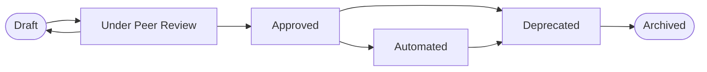
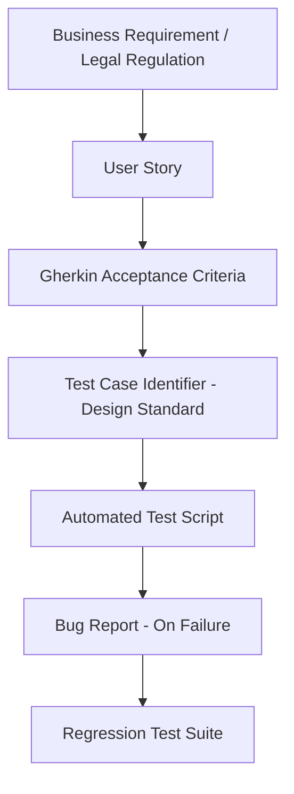

# Chapter 02: Test Case Design Methodology & Engineering Standard

## 2.1 Core Quality Invariants

Every test scenario indexed within the test management system *MUST* comply with the following five engineering principles:

* **Clarity:** The objective, preconditions, and expected results *MUST* be unambiguous. Any engineer must be able to execute the test without assistance from the author.
* **Atomicity:** A test case *MUST* validate a single business rule or conceptual flow. If a scenario covers multiple independent branches, it *MUST* be fragmented.
* **Independence:** Test cases *MUST NOT* have sequential dependencies on one another. The execution order of the suite must not alter the result. The required state is configured in isolation within preconditions or setup phases.
* **Repeatability:** The test case *MUST* consistently produce the same result under the same code version and data context, eliminating the occurrence of flaky tests.
* **Maintainability:** The test case design *SHOULD* minimize coupling with minor user interface changes through flow abstraction and the use of stable locators.

---

## 2.2 Definition of Ready (DoR)

Before proceeding with writing a test case, the requirement under analysis *MUST* meet the following criteria:

* [ ] **Requirement Approved:** The user story or technical specification is in a *Ready for Development / QA* status.
* [ ] **Acceptance Criteria Defined:** The acceptance criteria are described unambiguously (preferably using Gherkin syntax).
* [ ] **Dependencies Identified:** Dependencies on third-party services or external system components are known.
* [ ] **Environment Target Defined:** The environments necessary for validation have been specified (e.g., Staging, Sandbox).
* [ ] **Test Data Availability:** The strategy and source of the required data are pre-identified.

---

## 2.3 Quality Gates: Entry & Exit Criteria

The execution cycle of test suites is subject to the following regulatory conditions:

* **Entry Criteria:**
    * The user story meets the development *DoR*.
    * The source code is deployed to the QA environment after passing static analysis checks in the CI/CD pipeline.
    * Base test data (*fixtures*) are loaded and available.
* **Exit Criteria:**
    * Successful execution of 100% of critical regression test cases defined for the release scope.
    * Mitigation of product risks according to the internal prioritization matrix.
    * Quality metrics validated in the centralized dashboard (see **Chapter 10: QA Metrics & KPIs**).

---

## 2.4 Test Design Techniques Matrix

To maximize logical coverage while reducing test redundancy, the following ISTQB techniques are applied:

| Design Technique | Box Type | Core Use Cases | Engineering Goal |
| :--- | :--- | :--- | :--- |
| **Boundary Value Analysis (BVA)** | Black-Box | Numeric limits, input sizes, and business thresholds. | Identify failures in relational operators ($<, \le, >, \ge$). |
| **Equivalence Partitioning** | Black-Box | Reduction of infinite data universes into equivalent classes. | Optimize suite size by removing redundancies. |
| **Decision Table Testing** | Black-Box | Complex flows with multiple combinations of Boolean logic. | Map business rule interactions without leaving gaps. |
| **State Transition Testing** | Black-Box | Entity lifecycles (e.g., shopping order states). | Ensure invalid transitions are rejected. |
| **Pairwise / Combinatorial** | Black-Box | Configuration of multiple independent mutable variables. | Reduce exponential combinatorial growth using pairs. |
| **Use Case Testing** | Black-Box | End-to-end validations (e.g., user journeys). | Ensure seamless integration of system components. |
| **Error Guessing & Exploratory**| Experience | Tests based on time-boxing and specific test charters. | Discover complex defects outside the main happy path. |

---

## 2.5 Folder & Naming Convention

### 2.5.1 Directory Organization
Test cases inside the repository or test manager *MUST* be segregated by their technical domain:

```text
02-test-cases/
├── functional/
├── negative/
├── api/
├── security/
├── mobile/
└── accessibility/
```

*   **`functional/`:** Happy paths, alternative flows, and UI/UX business logic.
*   **`negative/`:** Exception handling, invalid data injection, and system robustness.
*   **`api/`:** Contract validations, JSON schemas, and HTTP status codes.
*   **`security/`:** RBAC validations, transport encryption, security headers, and vulnerabilities.
*   **`mobile/`:** Native iOS/Android scenarios, touch gestures, and network states.
*   **`accessibility/`:** WCAG accessibility guidelines compliance (A/AA/AAA), contrasts, and screen reader compatibility.


### 2.5.2 Semantic Naming
Each test case *MUST* follow the convention:
`TC_[MODULE]_[SUBMODULE]_[TEST_TYPE]_[SEQUENTIAL]`

*   **Web Functional Example:** `TC_AUTH_LOGIN_FUNC_001`
*   **Compliance API Example:** `TC_IAM_PII_COMP_014`

### 2.5.3 Tagging Strategy
For dynamic pipeline execution, test cases *SHOULD* include the following metadata tags:
*   **Scope:** `@Smoke`, `@Sanity`, `@Regression`
*   **Priority:** `@P0`, `@P1`, `@P2`, `@P3`
*   **Layer:** `@Web`, `@Mobile`, `@API`, `@Backend`
*   **Compliance:** `@Security`, `@GDPR`, `@DORA`, `@PCI-DSS`

---

## 2.6 Risk-Based Testing Prioritization Matrix

Priority assignment is determined by calculating the Risk Score:
$$\text{Risk Score} = \text{Business Impact (1-4)} \times \text{Failure Probability (1-4)}$$

| Business Impact | Failure Probability | Risk Score | Assigned Priority | CI/CD Execution Strategy |
| :--- | :--- | :--- | :--- | :--- |
| **Critical (4)** | **High (4)** | $12 - 16$ | **P0 (Critical)** | Mandatory execution per PR. Blocks merge on failure. |
| **High (3)** | **Medium (3)** | $8 - 9$ | **P1 (High)** | Mandatory execution in Nightly Builds and Pre-deployment. |
| **Medium (2)** | **Medium (2)** | $4 - 6$ | **P2 (Medium)** | Integrated execution in Weekly Regression Suites. |
| **Low (1)** | **Low (1)** | $1 - 3$ | **P3 (Low)** | On-Demand testing or maintenance execution. |

---

## 2.7 Test Data Strategy

The following abstraction categories are defined for test data management:
*   **Synthetic Data:** Data dynamically generated via code or algorithmic tools during the Setup phase. Recommended for isolated API testing.
*   **Production-like Masked Data:** Anonymized data sourced from a production copy using Data Masking techniques. *REQUIRED* for integration and UAT testing.
*   **Static Configuration Data:** Fixed environment values (e.g., country ISO codes). Stored in configuration files or fixtures.
*   **Dynamic Transactional Data:** Data created in real-time by a test step and immediately consumed by subsequent steps (e.g., `<TRANSACTION_ID>`).

---

## 2.8 Test Case Lifecycle & Review Workflow

The lifecycle of a test case is governed by the following state flow:



### 2.8.1 Peer Review Checklist
Before moving a test case status to *Approved*, a peer engineer *MUST* validate the following points:
*   [ ] **Reproducible & Independent:** Does not require the prior execution of another test case.
*   [ ] **Data Abstraction:** Contains no hardcoded values or credentials. Employs parameterized placeholders (`<PARAMETER>`).
*   [ ] **Automatable:** Steps describe clear logical interactions suitable for automation engines (see **Chapter 09: Test Automation Architecture**).
*   [ ] **Traceability:** Explicitly linked to a requirement or user story in the management system.
*   [ ] **Postconditions (Teardown):** Guarantees environment cleanup upon completion to prevent side effects in parallel runs.

---

## 2.9 Blueprints

### 2.9.1 Template 01: Web Functional Scenario

> **Central Template:** [View TC_PAY_CHECKOUT_FUNC_REUSABLE.md](../12-Templates/02-Test-Cases/TC_PAY_CHECKOUT_FUNC_REUSABLE.md)

### 2.9.2 Template 02: Compliance & Security Scenario

> **Central Template:** [View TC_IAM_PII_COMP_REUSABLE.md](../12-Templates/02-Test-Cases/TC_IAM_PII_COMP_REUSABLE.md)

---

## 2.10 End-to-End Traceability

A continuous upstream and downstream traceability model is established inside the project dashboards:



> [!NOTE]
> **Traceability Note:** Metrics relating to defect density, bug removal efficiency, and defect leakage rates to production (Defect Leakage Rate, DRE) are defined quantitatively in [10 - QA Metrics - KPIs](../10-QA-Metrics-KPIs/10 - QA Metrics - KPIs.md).

## References

- [10 - QA Metrics - KPIs](../10-QA-Metrics-KPIs/10 - QA Metrics - KPIs.md)
