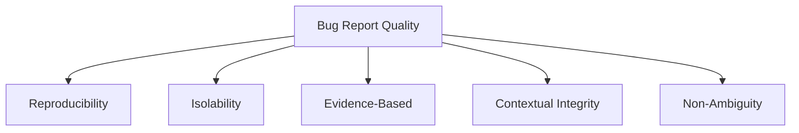
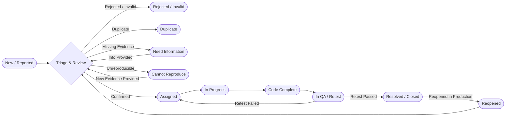
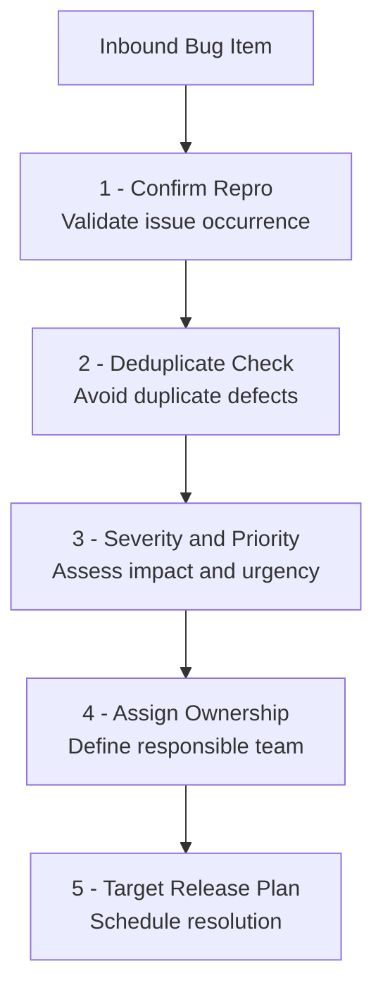
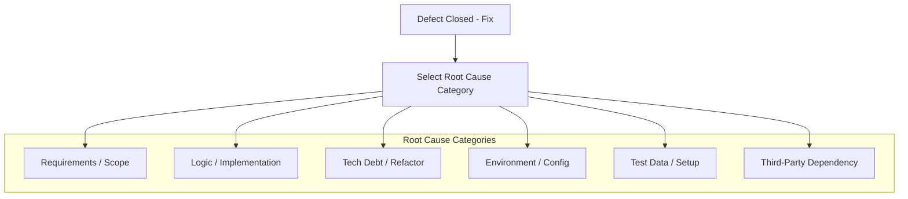
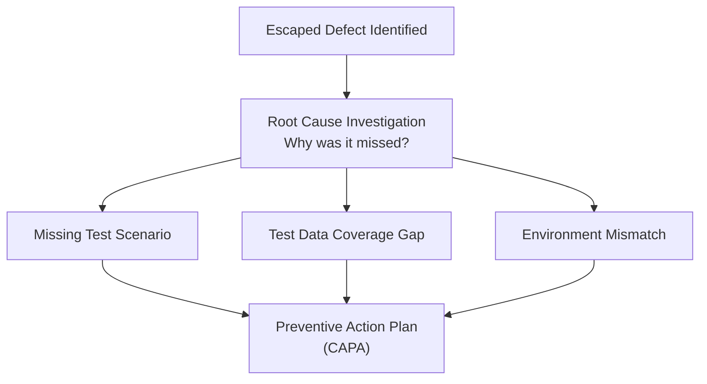

# Chapter 03: Engineering Standard for Bug Reporting and Management (Bug Report Engineering Standard & Governance)

## 3.1 Purpose and Governance Scope

The objective of a _Bug Report_ is not only to log a functional failure but to provide the technical evidence and operational context necessary for a cross-functional team to reproduce, prioritize, fix, and verify a defect expeditiously.

Within the software lifecycle governance, the defect acts as the primary traceability artifact to audit process quality. It allows identifying gaps in acceptance criteria, evaluating test containment in lower environments, and directly feeding the quantitative remediation and performance indicators analyzed in **Chapter 10: QA Metrics & KPIs**.

## 3.2 Core Quality Invariants

Every defect logged in the management system (_Jira, Linear, GitHub Issues_) _MUST_ comply with the following five reporting architecture principles according to the severity of the case:

- **Reproducibility:** The report _MUST_ contain deterministic steps to reproduce the failure. A non-reproducible defect _MUST NOT_ be assigned to development without first going through an investigation phase based on _logs_ or telemetry.
    
- **Isolability:** The report _MUST_ isolate the exact layer or component of the architecture where the failure originates (_Frontend, API Gateway, Microservice, Database, Third-party Integration_).
    
- **Evidence-Based:** Every report _MUST_ attach observable and verifiable technical evidence (_Network Payloads, Console Logs, Server Traces, APM Trace IDs, Screenshots, Screencasts_). For minor interface or typographical defects, this rule is relaxed to a _SHOULD_ level.
    
- **Contextual Integrity:** The report _MUST_ specify the environment, _Build_ version, _Commit Hash_, browser/device, and the test data or synthetic data scenarios used.
    
- **Non-Ambiguity:** The description of the expected behavior versus the actual behavior _MUST_ be concise, using standardized technical terminology without subjective or speculative judgments.

## 3.3 Bug Lifecycle & Ownership Matrix

The state flow of a defect is governed by the following deterministic state machine, in which each phase defines explicit governance responsibilities:

### 3.3.1 Ownership Matrix

|**State**|**Normative Definition**|**Responsible Roles (Owners)**|
|---|---|---|
|**New**|Defect logged in the tracking platform. Pending initial evaluation.|QA Engineer / Reporter|
|**Triage**|Technical and business evaluation to validate reproducibility, severity, priority, and assignment.|QA Lead + Tech Lead + Product Owner|
|**Need Information**|The report is incomplete (missing environment data, logs, or mandatory evidence). Requires remediation.|Reporter / QA Engineer|
|**Cannot Reproduce**|The report contains the required structure, but the technical team cannot replicate the behavior in any environment.|QA Engineer + Development Team|
|**Assigned**|Defect validated and incorporated into the _backlog_ of a specific developer or team.|Software Engineer / Engineering Team|
|**In Progress**|The technical fix is being actively implemented in a code branch.|Software Engineer|
|**Code Complete**|The _Pull Request_ with the _fix_ has been merged and deployed to the testing environment.|Engineering Team + CI/CD Pipeline|
|**In QA / Retest**|Execution of direct verification tests and associated regression tests.|QA Engineer|
|**Resolved / Closed**|Successful verification of the _fix_. The ticket is formally closed and the test is linked.|QA Engineer / QA Lead|
|**Reopened**|The failure persists after the re-test or reappears in a higher environment (_Escaped Defect_).|QA Engineer / Release Manager|

## 3.4 Bug Triage Protocol

The _Bug Triage_ is the governance ritual where operational decisions are made regarding the defect _backlog_. It should be executed with a frequency aligned to the team's cadence (daily in critical projects, or 2-3 times a week in regular _Agile_ flows) with the mandatory participation of QA, Development, and Product.

### 3.4.1 Triage Protocol Principles

- **Confirm Reproducibility:** Verify that the report complies with the deterministic steps standard before acceptance.
    
- **Deduplicate Check:** Query the repository to avoid duplicate open tickets regarding the same component or root cause.
    
- **Severity & Priority Alignment:** Adjust technical severity levels and business priority based on the project's objective matrix.
    
- **Assignment & Resolution Strategy:** Determine if the _fix_ requires immediate intervention (_Hotfix_), inclusion in the current _Sprint_, or planned postponement in the _backlog_.

## 3.5 Severity vs. Priority Matrix

The classification of a defect _MUST_ separate the technical impact of system degradation (_Severity_) from the operational impact and business urgency (_Priority_).

### 3.5.1 Normative Definitions

- **Severity (Technical Impact):** Measures the technical gravity of the failure on the architecture, security, or data integrity.
    
- **Priority (Business Urgency):** Measures the required speed to deploy the solution based on user impact or business commitments.

### 3.5.2 Classification Matrix

|**Technical Severity**|**Business Priority**|**Technical Application Criteria**|**Target SLA**|
|---|---|---|---|
|**S1 - Blocker / Critical**|**P0 - Immediate**|Total system crash, unrecoverable data corruption, critical security vulnerability (e.g., BOLA, _PII_ leakage in logs), inability to complete the main transaction without a _workaround_.|$< 4$ hours|
|**S1 - Blocker / Critical**|**P2 - Medium**|Critical failure in a secondary or low-usage module that has an automated or simple technical _workaround_ for the user.|Next _Sprint_ / Planned|
|**S2 - High**|**P1 - High**|Main functionality degraded, non-blocking financial calculation errors, recurring failures in integration endpoints.|$< 24 - 48$ hours|
|**S3 - Medium**|**P2 - Medium**|Form validation errors, responses outside performance _SLA_ but operational, secondary inconsistencies in API payloads.|Within current _Sprint_|
|**S4 - Low**|**P3 - Low**|Aesthetic inconsistencies in UI, minor typographical errors, slight style deviations without impact on usability.|_Backlog_ / Refinement|
|**S4 - Low**|**P0 - Immediate**|Typographical error in the product name, distorted corporate logo, or legal/compliance inconsistency on the _landing page_ prior to a massive launch.|$< 8$ hours|

### 3.5.3 Practical Contextualization Example

- **Scenario A (S2 High / P1 High):** The tax calculation in the _checkout_ returns a value with a two-cent difference.
    
    - _Reason:_ Non-blocking financial inaccuracy in the gateway, but which generates immediate accounting inconsistencies.
        
- **Scenario B (S4 Low / P0 Immediate):** Typographical error in the Terms and Conditions clause during a global _marketing_ campaign.
    
    - _Reason:_ Null technical impact (S4), but critical legal or reputational risk requiring immediate deployment (P0).

## 3.6 Defect Aging Management

Quality control requires monitoring the aging of unresolved errors to prevent the accumulation of technical debt. The following escalation rules are defined based on open time:

|**Priority Level**|**Aging Threshold**|**Governance / Escalation Action**|
|---|---|---|
|**P0 - Immediate**|$> 12$ hours without active _fix_|Automatic escalation to _Engineering Manager_ and _Tech Lead_. Call for a _War Room_.|
|**P1 - High**|$> 5$ business days|Notification in the _Daily Scrum_. Evaluation for resource reallocation in the ongoing _Sprint_.|
|**P2 - Medium**|Extension exceeding 1 _Sprint boundary_|Mandatory review in _backlog_ refinement. Evaluation for downgrade to P3 or discard.|
|**P3 - Low**|$> 90$ days without interaction|Backlog cleanup. Automatic closure or reclassification by the _Product Owner_.|

## 3.7 Defect Taxonomy and Nature Classification

To enable qualitative root cause analysis in engineering retrospectives, every logged defect _MUST_ be classified into one of the following categories by its technical nature:

- **Functional:** Deviations in business rules, application logic, or acceptance criteria.
    
- **API / Integration:** API contract failures, incorrect HTTP status codes, failed data deserialization, or schema misalignment.
    
- **Security & Compliance:** OWASP vulnerabilities, authentication/authorization (RBAC) failures, unmasked _PII_ exposure, or non-compliance with secure transport (TLS/HTTPS).
    
- **UI / UX:** Interface inconsistencies, non-responsive components, or design system violations.
    
- **Data Integrity:** Corrupted data, migration failures, database schema inconsistencies, or lack of referential integrity.
    
- **Performance:** Excessive latency outside target time, anomalous memory consumption, or degradation under load.
    
- **Infrastructure / Config:** Errors in environment variables, network configurations, containers, or cloud services.
    
- **Accessibility:** Non-compliance with WCAG guidelines (A/AA), missing semantic tags, or keyboard navigation failures.

## 3.8 Metadata Structure and Traceability

Each defect ticket _MUST_ use the title convention:

`[BUG]_[MODULE]_[COMPONENT]_[SHORT_DESCRIPTION]`

### 3.8.1 Mandatory Traceability Fields and Regression Scope

To guarantee the closure of the quality cycle and enable the calculation of advanced metrics (see **Chapter 10: QA Metrics & KPIs**), the registration form _MUST_ require the following structured fields:

- **Requirement Reference:** ID of the associated user story or technical specification (`<USER_STORY_ID>`).
    
- **Acceptance Criteria:** Specific criteria not met (`<ACCEPTANCE_CRITERIA_ID>`).
    
- **Environment Detected:** `Development`, `QA`, `Staging`, `UAT`, `Production`.
    
- **Phase Introduced:** `Requirements`, `Design`, `Development`, `Configuration`, `Third Party`.
    
- **Phase Detected:** `QA Feature Testing`, `QA Regression Testing`, `UAT`, `Production`.
    
- **Escaped Defect Indicator:** Binary checkbox (`Yes` / `No`).
    
- **Automated Test Candidate:** Binary checkbox (`Yes` / `No`).
    
- **Regression Scope:** Defines the scope of re-execution after applying the _fix_:
    
    - `None`: Isolated fix with no impact on neighboring modules.
        
    - `Feature`: Re-execution of the direct module or component.
        
    - `Module`: Re-execution of the subsystem and its integration contracts.
        
    - `Full Regression`: Re-execution of the complete regression suite (required for core/infrastructure changes).

## 3.9 Root Cause Analysis (RCA)

During the defect closure phase (`Resolved / Closed`), the engineering team _MUST_ categorize the technical root cause of the problem to prevent systematic recurrences:

- **Requirements / Scope:** Ambiguous, omitted, or altered specification without updating the acceptance criteria.
    
- **Logic / Implementation:** Programming error, incorrect exception handling, or deficient algorithms.
    
- **Tech Debt / Refactor:** Regression caused by changes in legacy components or lack of unit tests.
    
- **Environment / Config:** Misalignment of environment variables, unstable infrastructure, or network permissions.
    
- **Test Data / Setup:** Outdated, corrupted, or missing test data in the execution environment.
    
- **Third-Party Dependency:** Failures or unnotified changes in external services or third-party libraries.

## 3.10 Bug Leakage Analysis

When a defect is identified in advanced environments (`UAT` or `Production`), being marked as `Escaped Defect = YES`, a structured leakage analysis must be executed:

### 3.10.1 Guiding Questions for Leakage Analysis

1. **Why was it not detected in the corresponding testing phase?** (Lack of coverage in test cases, unrealistic test data, or QA environment misalignment vs. production).
    
2. **What testing gap allowed the escape?** (Absence of edge testing, lack of concurrency testing, or omitted security validations).
    
3. **What is the corrective and preventive action (CAPA)?** (Add regression automation, adjust _Data Masking_ scripts, or update pipeline _Quality Gates_).

## 3.11 Technical Evidence Collection Guide by Domain

The type of attached technical evidence _MUST_ adapt to the affected technical domain:

### 3.11.1 Web / Frontend UI Bugs

- Screencast or annotated screenshot highlighting the failure.
    
- Browser console logs (_Console Errors_).
    
- HAR file (_HTTP Archive_) when network requests are involved.

### 3.11.2 API / Backend Bugs

- Endpoint and HTTP method (`POST /v1/orders`).
    
- HTTP Headers, masking any access token.
    
- Input payload (_Request Body JSON_).
    
- Response payload (_Response Body JSON_) and HTTP status code (_Status Code_).
    
- Trace ID / Correlation ID logged in APM (_Datadog, New Relic_) for tracking.

### 3.11.3 Security / Compliance Bugs

- Evidence of sensitive data (_PII_) exposed unmasked in logs or responses.
    
- Demonstration of lack of transport encryption (HTTP instead of HTTPS).
    
- Verification of cross-authorization failure (BOLA/RBAC) with user context.

## 3.12 Defect Prevention & Feedback Loop

To guarantee that defect reporting contributes to the continuous improvement of the delivery process, the resolution of every S1 or S2 defect _MUST_ consider the following preventive mechanisms:

- **Regression Automation:** If the `Automated Test Candidate` field is marked as `Yes`, the ticket cannot be closed without linking the _Pull Request_ that incorporates the new automated test in the regression suite (see **Chapter 09: Test Automation Architecture**).
    
- **Documentation Update:** Mandatory update of API specifications, architecture diagrams, or acceptance criteria in case the failure was caused by document misalignment.
    
- **Observability Alerting:** Creation or adjustment of monitoring rules and APM alerts to proactively detect similar anomalies in production environments.

## 3.13 Bug Report Blueprint

> **Central Template:** [View BUG_REPORT_TEMPLATE.md](12-Templates/03-Bug-Reports/BUG_REPORT_TEMPLATE.md)

## References

- [01 - Test Strategy](01%20-%20Test%20Strategy.md) (Strategy and risk management)
- [02 - Test Cases](02%20-%20Test%20Cases.md) (Test design and traceability)
- [08 - Jira-Xray](08%20-%20Jira-Xray.md) (Traceability management and coverage in ALM tools)
- [10 - QA Metrics - KPIs](10%20-%20QA%20Metrics%20-%20KPIs.md) (Quantitative metrics of leakage and defect removal)
