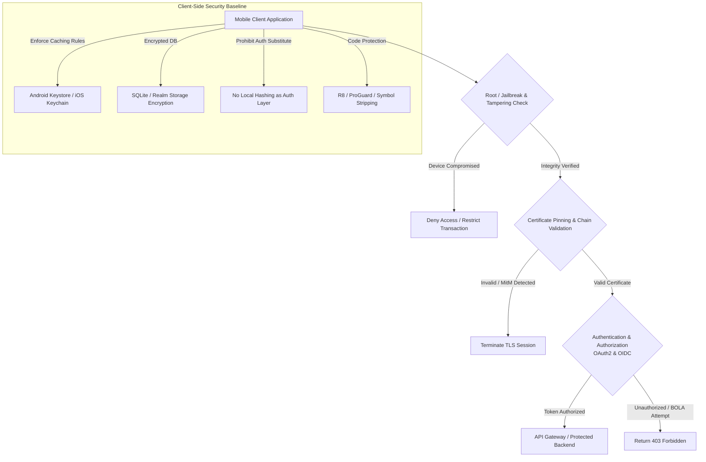
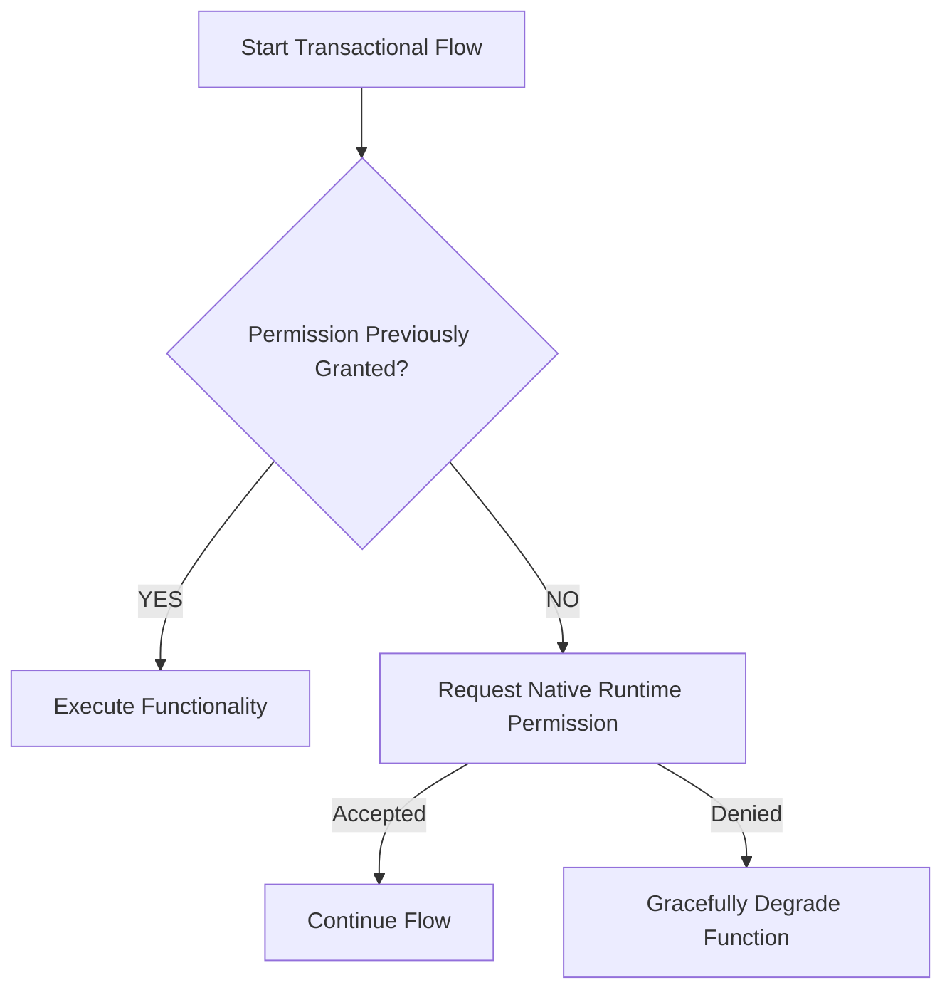
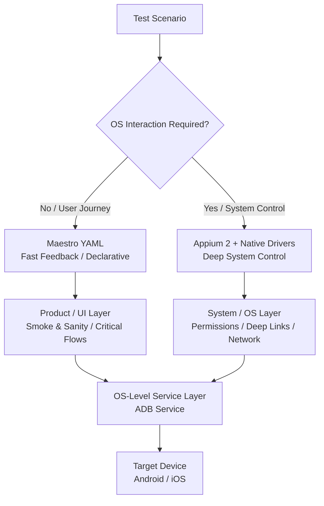
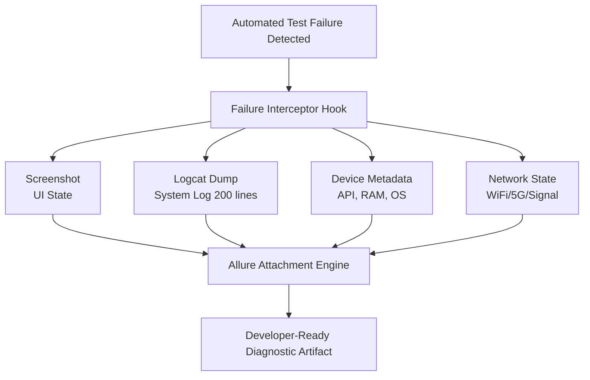

# Chapter 04: Mobile Testing Strategy & Engineering Standard

## 4.1 Mobile Quality Invariants

Every software solution distributed on mobile platforms (Android and iOS) **MUST** strictly comply with the following six normative engineering principles before being approved for release in official stores (_Apple App Store_ and _Google Play Store_):

1. **Client-Side Security:** Mobile applications **MUST NOT** store secrets, private API keys, persistent access tokens in plain text, or PII (_Personally Identifiable Information_) within the local database (SQLite, Realm), preferences storage (`SharedPreferences`, `UserDefaults`), or compiled code. All network communication **MUST** be executed through encrypted HTTPS/TLS transports with strict certificate validation.

2. **Network & Resource Resilience:** The application **MUST** autonomously manage network volatility (transitions between WiFi, 4G, 5G, cell handover, high latency, packet loss, and airplane mode) without causing catastrophic failures (_crashes_), cache data corruption, or loss of ongoing transaction state.

3. **Device Matrix & OEM Coverage:** Regression executions **MUST** validate the defined device matrix considering processor architectures (ARM64), resolutions, pixel densities (dpi), Original Equipment Manufacturer (OEM) customization layers, and officially supported Operating System versions.

4. **Performance & Energy Consumption:** The application **MUST NOT** exceed corporate baselines for memory leaks, sustained CPU usage, frame rendering time, and thermal/energy impact on the target device.

5. **User Experience & Accessibility Compliance:** The interface **MUST** guarantee touch response times below usability limits, adapt the layout to screen/orientation variations, and comply with native accessibility guidelines (VoiceOver on iOS and TalkBack on Android) under the WCAG 2.1 / 2.2 AA standard, verified through native scanning tools.

6. **Data Integrity & Transaction Safety:** Critical transactions **MUST** be idempotent. Automatic retries generated by the client layer or unexpected process closures (_process death_) **MUST NOT** duplicate commercial or financial transactions, nor leave the application in an inconsistent state.

---

## 4.2 Mobile Test Environment Strategy

The environment selection and deployment strategy **MUST** balance continuous integration (CI/CD) feedback speed with the physical hardware fidelity in pre-release phases.

### 4.2.1 Emulators and Simulators (Virtual Environments)

Virtual environments (Android Emulators / iOS Simulators) **MUST** be the primary target in the early stages of the development cycle (_Commit_ and _Pull Request Verification_ phase).

- **Indication:** Unit testing, isolated component testing, business logic validation, and automated Smoke Tests.

- **Limitations:** Emulators do not accurately reproduce ARM hardware architecture, radio frequency modules (cellular modems), thermal behavior, or power consumption restrictions imposed by the manufacturer's firmware.

### 4.2.2 Physical Hardware and Device Farms

Validation on real hardware is **MANDATORY** for E2E regression, performance, interruption, battery consumption tests, and release candidate validation.

- **On-Premise Device Labs:** Local device labs connected to dedicated execution nodes **MUST** be used when strict data privacy regulations prohibit the use of external clouds.

- **Cloud Device Farms:** Managed platforms (e.g., AWS Device Farm, Sauce Labs, BrowserStack) **MUST** be used to expand the fragmentation matrix coverage across global heterogeneous devices. They **MUST** guarantee execution on real hardware, strict OS version control, factory reset capabilities, and network throttling simulation.

### 4.2.3 Fragmentation Dimension and OEM Layers

On the Android platform, testing **MUST** evaluate behaviors resulting from operating system modifications introduced by major manufacturers:

| **Manufacturer / OS Layer** | **Main Risk Factor** | **Critical Technical Behavior to Validate** |
|---|---|---|
| **Samsung (One UI)** | Aggressive power management restrictions. | Suspension of _Background Workers_, disabling of scheduled tasks (`JobScheduler`), and premature service termination. |
| **Xiaomi (MIUI / HyperOS)** | Non-standard memory optimization and permission management. | Force close of background processes when the screen is locked; loss of Push notifications (`FCM`). |
| **Huawei (EMUI / HMS)** | Absence of Google Mobile Services (GMS). | Incompatibility with native Google Maps libraries, location services (`LocationServices`), and _In-App Purchases_. |
| **Google (Stock Android)** | Reference implementation of the Android SDK. | Validation of standard baseline behavior before executing on OEM layers. |
| **Apple (iOS / iPadOS)** | Diversity of _Form Factors_ and screen notches (_Dynamic Island_ / _Notch_). | Occlusion of user interface elements by _Safe Area Insets_ and typographic scaling variations. |

---

## 4.3 Mobile Security Standards

The security architecture in mobile applications operates under a _Zero-Trust_ model, assuming that the client device is in an uncontrolled or potentially hostile environment. The chain of controls **MUST** be applied in the order defined below:



### 4.3.1 Transport and Network Security Rules

- **Mandatory HTTPS/TLS:** All network requests **MUST** use HTTPS with TLS 1.3 as the target version. TLS 1.2 is the minimum allowed version. TLS 1.0 and 1.1 versions **MUST NOT** be enabled in any production build.

- **URL Cleanliness:** No session token, API key, or personally identifiable data (_PII_) **MUST NOT** be transmitted in the _Query Parameters_ of the URL. These values **MUST** be transported exclusively in HTTP headers or in the encrypted request body.

- **Password Transmission & Authentication:** Client applications **MUST NOT** implement local password hashing or encryption functions as a substitute for the backend authentication layer. Credential protection relies on the TLS layer, certificate validation, and backend authentication delegation (OAuth2 / OIDC).

### 4.3.2 Runtime Permissions Matrix (Android & iOS)

Applications **MUST** request runtime permissions progressively and contextually (_Just-In-Time Permission Requests_):



- **Critical Permissions to Validate:** Location (Precise vs. Approximate / _In-Use_ vs. _Always_), Camera, Microphone, Storage/Photos, Contacts, and Push Notifications.

- **Permission Denial Test:** Upon denying a permission, the application **MUST NOT** crash. It **MUST** present clear explanations and offer alternatives or an explicit redirection to the system configuration (_App Settings_).

- **Dynamic Revocation:** Injection of permission revocation from the OS settings while the app is in the background. The app **MUST** correctly restore its state when returning to the foreground.

### 4.3.3 Local Storage and Device Integrity Rules

1. **Secure Storage API:** Authentication tokens (JWT, Refresh Tokens) and confidential data **MUST** be stored exclusively in hardware-backed operating system mechanisms: Keychain on iOS and Keystore-backed encryption on Android.

2. **Certificate Pinning & Network Trust Validation:** Applications managing medium/high-risk sensitive information **SHOULD** implement _SSL/TLS Certificate Pinning_. Applications classified as Critical Risk (financial, healthcare) **MUST** implement additional certificate chain validation controls and transport protection to prevent _Man-in-the-Middle_ (MitM) attacks.

3. **Storage Encryption:** Locally embedded databases (SQLite, Realm) **MUST NOT** store secrets, credentials, or PII without full encryption of data at rest and secure key management.

4. **Anti-Tampering & Root Detection:** Production builds **MUST** include runtime checks to detect rooted/jailbroken devices or the presence of injection frameworks (_Frida_, _Xposed_, or equivalent tools), applying additional controls or transactional restrictions based on the defined risk profile.

5. **Code Obfuscation:** Final builds (_Release Builds_) **MUST** be processed using code obfuscation tools (ProGuard/R8 on Android, symbol stripping on iOS) to hinder reverse engineering.

---

## 4.4 Interruption Resilience, Offline Mode, and Recovery

Resilience tests **MUST** ensure that the application maintains transactional integrity and operational continuity in the face of abrupt changes in the device environment.

### 4.4.1 Interrupt Testing Matrix

| **Interruption Event** | **Entry Condition** | **Expected Behavior (Validation Gate)** |
|---|---|---|
| **Incoming Call / SMS** | The application is in the middle of a transaction or data entry. | The application goes to the _Background_. Upon the end of the interruption, it returns to the _Foreground_, fully preserving the screen state. |
| **Connectivity Loss** | Sudden network disconnection during an active request. | The system catches the exception, displays an informative message without raw infrastructure details, and allows the user to retry the action. |
| **Low Battery** | OS notification of critical battery level (e.g., 5%). | The application does not interrupt local data persistence and allows the user to save the current state. |
| **OS Process Kill (Background)** | The OS kills the background process due to memory constraints. | Upon reopening the application, the session state is securely restored from encrypted storage without causing _crashes_. |
| **Lifecycle Transition** | Sending the app to the background and locking the screen (_Process Death_). | The client **MUST** rehydrate the view state without losing any user-entered information. |

### 4.4.2 Offline Operation and Synchronization Standard (Offline-First Strategy)

In scenarios where the application supports _Offline-First_ functionality or local transaction queuing:

- **Local Data Persistence:** Transactions executed without a network **MUST** be logged in an encrypted local database in a pending synchronization state.

- **Conflict Resolution Strategy:** Upon connectivity restoration, the synchronization engine **MUST** resolve conflicts between the local state and the server through explicit business policies (e.g., _Server-Wins_ or _Last-Write-Wins_), defined by the product team according to the use case.

- **Idempotency Execution:** Re-transmitting queued requests **MUST** include unique transaction identifiers (`Idempotency-Key`) in HTTP headers to prevent duplications on the backend server.

---

## 4.5 Mobile Performance Metrics

Client performance **MUST** be quantitatively measured using native instrumentation. The four metrics defined below cover complementary dimensions: visual fluidity, startup, memory, and energy.

### 4.5.1 Mathematical Formulas and Metric Definitions

#### 1. Frame Drop Rate (DFR)

Measures the degradation of visual fluidity by evaluating the percentage of frames that exceed the rendering time budget ($16.6\text{ ms}$ for $60\text{ Hz}$ screens or $8.33\text{ ms}$ for $120\text{ Hz}$):

$$\text{DFR} = \left( \frac{N_{\text{dropped}}}{N_{\text{total}}} \right) \times 100$$

- **Definition:** $N_{\text{dropped}}$ is the number of frames rendered outside the established threshold; $N_{\text{total}}$ is the total number of frames generated during the test interval.
- **Measurement Objective:** Detect visual stutters (_jank_) during scrolling or UI animations.
- **Interpretation:** As an initial baseline reference, a $\text{DFR} > 5\%$ indicates visual degradation in the client layer requiring technical analysis.
- **Tools:** _Android GPU Rendering Profiler_, _Perfetto_, _Xcode Instruments (Core Animation)_.

#### 2. App Cold Start Time (ACST)

Time elapsed from when the user launches the application process until the first frame is interactive:

$$\text{ACST} = T_{\text{First Interactive Frame}} - T_{\text{Process Launch}}$$

- **Definition:** Difference in seconds between the process launch instance and the instance when the first interactive frame is rendered on screen.
- **Measurement Objective:** Quantify the impact of the initial startup on the user experience; detect regressions introduced by dependency initialization, remote configuration loading, or local database migrations.
- **Interpretation:** A time $\le 2.0\text{ seconds}$ on mid-range devices is the goal. Values greater than $3.0\text{ seconds}$ are considered a critical experience regression.
- **Tools:** _Firebase Performance Monitoring_, _Android Vitals_, _Xcode Metrics (Launch Time)_.

#### 3. Battery Consumption Rate (BCR)

Measures the impact of the application's execution on the device's autonomy per unit of time:

$$\text{BCR} = \frac{\Delta \text{Battery (\%)}}{\Delta t \text{ [Hours]}}$$

- **Definition:** Percentage variation of the battery level consumed divided by the duration of the test session in hours.
- **Measurement Objective:** Evaluate the energy impact of background routines, network polling, and GPS/Modem module usage.
- **Interpretation:** As a standard operational baseline, consumption exceeding $10\%/\text{hour}$ during standard scenarios requires investigation based on the workload classification (e.g., background sync vs. intensive camera/AI processing).
- **Tools:** _Android Battery Historian_, _Xcode Instruments (Energy Log)_.

#### 4. Memory Leak Index (MLI)

Quantifies the anomalous accumulation of RAM assigned to the process after repeated cycles of use and Garbage Collection:

$$\text{MLI} = \frac{M_{\text{final}} - M_{\text{initial}}}{N_{\text{cycles}}}$$

- **Definition:** Difference in megabytes ($\text{MB}$) of Heap memory retained between the final and initial state, divided by the number of navigation/action repetitions.
- **Measurement Objective:** Detect improper context retention (`Context Leaks` in Android, `Retain Cycles` in iOS).
- **Interpretation:** A sustained positive $\text{MLI}$ after repeated cycles and explicit garbage collector invocation points to a possible active memory leak requiring analysis.
- **Tools:** _LeakCanary (Android)_, _Xcode Memory Graph Profiler / Instruments (Leaks)_.

---

## 4.6 AI-Enabled Mobile Features

For applications integrating Artificial Intelligence capabilities executable on the device (_On-Device AI_) or connected to external AI services (ASR, TTS, NLU, Computer Vision, or generative models):

- **Validation Boundary:** Testing components with AI functionalities **MUST** be executed by evaluating functional precision, operational resilience, and the impact of AI processing on the mobile device's own constraints.

- **Execution Context:** The validation strategy **MUST** differentiate between locally executed capabilities (_On-Device AI_) and those dependent on remote services (_Cloud AI_), because they present different risk profiles related to performance, connectivity, resource consumption, and availability.

- **Cross-Reference:** The detailed methodology for model quality evaluation, hallucinations, tool accuracy, RAG evaluation, _Guardrails_, and safety metrics in intelligent systems is governed as established in **Chapter 06: AI Systems, RAG Evaluation & Agentic Testing Standard**. No model quality scoring is performed at the mobile client layer.

| **Mobile AI Domain** | **Main Risk** | **QA Validation** |
|---|---|---|
| **On-Device AI** (TensorFlow Lite, CoreML, ONNX Runtime) | Device performance, memory, battery, and temperature consumption. | Measurement of inference latency, CPU/GPU/NPU usage, Heap memory, and thermal behavior. |
| **Cloud AI Services** (LLMs, Generative AI APIs) | Network dependency, latency, and remote service availability. | Validation of timeouts, loading states, streaming responses, and recovery from connection errors. |
| **ASR / TTS** (Speech recognition and synthesis) | Input variability and acoustic environmental conditions. | Evaluation with ambient noise, different accents, speech speed, and varying microphone quality. |
| **Computer Vision** | Visual variability and image quality degradation. | Tests under low lighting, motion blur, partial occlusions, and capture variations. |
| **Offline & Fallback Strategy** | Loss of operational continuity due to lack of connectivity. | Verification of correct transition to a local model, degraded mode, or subsequent recovery. |
| **AI Safety & Trust** (Guardrails, Model Behavior) | Unsafe responses, unexpected behavior, or policy non-compliance. | Validation of security controls integration in UI/client and derivation of deep evaluation to Chapter 06. |

### 4.6.1 On-Device Inference Validation

Locally executed AI capabilities using frameworks such as TensorFlow Lite, CoreML, or ONNX Runtime **MUST** be evaluated considering the physical limitations of the device:

1. **Inference Performance:**
   - Measure the model's response time under representative real-use scenarios.
   - Validate that the latency complies with the SLA defined for the use case.
   - Evaluate the utilization of available device accelerators (NPU, GPU, or CPU).

2. **Local Resource Consumption:**
   - Validate the model's impact on Heap memory, CPU, GPU, and battery.
   - Detect thermal degradations caused by prolonged inferences.
   - Establish consumption baselines according to the model, target device, and functional scenario.

3. **Hardware Compatibility:**
   - The application **MUST** implement fallback mechanisms when the target device lacks NPU or GPU acceleration.
   - The user experience **MUST NOT** degrade unexpectedly due to limitations of the device's SoC.

### 4.6.2 Multimodal Input Validation

AI functionalities based on sensors or human inputs **MUST** be validated under variable conditions representing real user scenarios.

#### Speech Recognition (ASR / TTS)
Testing **MUST** evaluate:
- Ambient noise variations.
- White noise and interfering sounds.
- Different speaking speeds and patterns.
- Accent variations.
- Quality differences between microphones and devices.

The system **MUST** maintain stable behavior in the face of normal input signal degradation.

#### Computer Vision
Testing **MUST** include:
- Reduced lighting conditions.
- Variable contrast.
- Motion blur.
- Partial occlusions of the detected object.
- Capture distance and orientation variations.

The application **MUST** provide controlled results or explicit degradation when the input quality does not allow reliable inference.

### 4.6.3 Cloud AI Resilience

AI functionalities dependent on external services **MUST** validate behavior under variable connectivity conditions:
- High network latency.
- Temporary loss of connection.
- Remote service timeouts.
- Partial responses or interruptions during streaming.
- Temporary unavailability of the AI provider.

The application **MUST** provide:
- Clear visual processing states.
- Progress indicators or streaming responses where appropriate.
- Understandable error messages for the user.
- Strategies for recovery or controlled degradation.

### 4.6.4 Fallback Strategy and Offline Operation

When an AI functionality depends on external connectivity, the application **SHOULD** define an explicit operational continuity strategy:
- Use of alternative local models when available.
- Controlled reduction of functionalities.
- Preservation of user state during interruptions.
- Subsequent synchronization when connectivity is restored.

The transition between online and offline modes **MUST NOT** cause data loss, inconsistent states, or unexpected behaviors.

### 4.6.5 Evaluation Limit with Complex AI Systems

Mobile validation focuses on:
- Integration of the model within the device.
- Impact on mobile resources.
- Availability and resilience of the user flow.
- Interaction quality from the client's perspective.

Deep evaluation of model accuracy, hallucinations, response safety, RAG evaluation, correct tool usage, and safety guardrails is defined in **Chapter 06: AI Systems, RAG Evaluation & Agentic Testing Standard**.

---

## 4.7 Production Telemetry Integration

Pre-release quality validations **MUST** be continuously complemented by application behavior telemetry in production:

- **Crashlytics & Error Aggregation:** Regression tests **SHOULD** include periodic review of production dashboards (_Crashlytics_, _Sentry_, _Datadog_) to transform high-frequency exceptions (_Non-Fatal Errors_) into automated test cases.

- **Production Quality Feedback:** A metric of _Crash-Free Sessions_ $\ge 99.5\%$ and _Crash-Free Users_ $\ge 99.0\%$ in production acts as a normative _Quality Gate_ to maintain continuous version promotion.

---

## 4.8 Accessibility Compliance

Mobile applications **MUST** be auditable using native accessibility tools on each platform (_Android Accessibility Scanner_, _iOS Accessibility Inspector_, _Espresso Accessibility Checks_, _XCTest Accessibility APIs_):

- **Touch Target Size:** All interactive elements **MUST** have a minimum touch area of **48x48 dp** on Android and **44x44 pt** on iOS.

- **Accessibility Labels & Roles:** UI components **MUST** include explicit metadata (`contentDescription` in Android, `accessibilityLabel` / `accessibilityHint` in iOS), omitting the inclusion of control types within the text (e.g., use "Submit", not "Submit Button").

- **Dynamic Type Support:** Text views **MUST** adapt to the font size preferred by the user in the OS settings without clipping the text or overlapping components.

- **Color Contrast:** The color contrast between text and its background **MUST** meet a minimum threshold of **4.5:1** for normal text and **3:1** for large text (WCAG 2.2 Level AA compliance).

---

## 4.9 Mobile Automation Architecture Standard

Mobile automation suites **MUST** follow the architectural principles defined in this chapter and align with the cross-cutting standard defined in **Chapter 09: Test Automation Architecture**.

### 4.9.1 Automation Scope Rules

- **Priority Journeys:** Mobile automation **MUST** prioritize critical user flows, high-value commercial transactions, and core regression paths.

- **Exploratory Balance:** Automated tests **MUST NOT** replace the execution of human exploratory testing on real physical devices.

### 4.9.2 Semantic Locators and Prohibited Strategies

- **Preferred:** Exclusive use of dedicated test identifiers (`test-id`, `accessibility-id`) or native semantic roles.

- **Prohibited:** Use of absolute XPaths, selections based on the visual coordinate tree structure, or volatile numeric indices.

```typescript
// ✅ ENFORCED — Stable Accessibility ID, decoupled from visual structure
const submitButton = driver.$('~btn_confirm_payment');
await submitButton.click();

// ❌ PROHIBITED — Fragile absolute XPath; breaks with any view hierarchy change
const brittleButton = driver.$('/hierarchy/android.widget.FrameLayout/android.widget.LinearLayout[1]/android.widget.Button[2]');
await brittleButton.click();
```

---

## 4.10 Hybrid Mobile Automation Architecture

### 4.10.1 Hybrid Automation Architecture Principles

In complex mobile ecosystems, a _Single-Tool Strategy_ creates operational bottlenecks: deep system automation (e.g., Appium) increases fragility and execution times in simple product flows, while lightweight declarative tools (e.g., Maestro) lack access to OS manipulation and low-level diagnostics.

Every mobile quality engineering platform **MUST** adopt a Multi-Layer Hybrid Architecture, segregating automation responsibilities into three independent layers:



### 4.10.2 Tool Selection Matrix

Assigning an automation tool to a test scenario **MUST** be done by evaluating four technical dimensions: Feedback Speed, Maintenance Effort, Technical Depth, and Diagnostic Quality.

- **Declarative Layer Usage Rule:** Maestro **SHOULD** be prioritized for deterministic _user journeys_ where validation mainly depends on the application's visible behavior. It **MUST NOT** replace OS native validation scenarios.

| **Test Domain** | **Designated Tool** | **Selection Criteria and Technical Capability** | **Execution Layer** |
|---|---|---|---|
| **Smoke & Sanity Testing** | Maestro (Declarative Layer) | Rapid app startup and login validation. Execution without prior compilation, low latency, and minimal declarative maintenance. | Product / UI |
| **Critical User Journeys** | Maestro (Declarative Layer) | E2E testing of transactional flows (Checkout, Cart, Registration). Prioritizes execution speed over system control. | Product / UI |
| **Lifecycle Management** | Appium 2 + Native Drivers (UiAutomator2 / XCUITest) | Clean APK/IPA installation, upgrade between candidate versions, verification of data state persistence, and uninstallation. | System / Device |
| **Dynamic Permissions** | Appium 2 + ADB / XCUITest | Dynamic granting and revocation of permissions at runtime (Camera, Location, Notifications) and recovery verification. | System / OS |
| **Deep Link Routing** | Appium 2 + ADB / XCUITest | Injection of custom URI schemes (`myapp://products/123`) via Android Intents or Apple Events to validate navigation routing. | System / Intent |
| **Network Resilience** | Appium 2 + ADB Service | Simulation of connectivity loss, dynamic network switching (WiFi to Cellular/Airplane Mode), and recovery of hanging transactions. | Network / OS |
| **Diagnostics & Crash Extraction** | ADB Service + Allure | Automatic capture of system Logcat, process memory dumps (_heap dumps_), and device metadata upon failure. | Infrastructure |

### 4.10.3 System Manipulation Infrastructure Layer (ADB Service Standard)

UI interaction tools **MUST NOT** execute system configuration tasks directly if a native OS interface exists. The ADB Service Layer pattern is defined to isolate Android environment manipulation from automation specs.

#### Infrastructure Service Rules

1. **Strict Separation:** The ADB service **MUST** reside in a shared utilities layer (`src/infrastructure/mobile/adb/adb.service.ts`) and be consumed via exposed APIs.

2. **No UI Involvement:** ADB **MUST NOT** be used to simulate clicks on application interface elements (`adb shell input tap`) that can be manipulated through the accessibility layer or the W3C driver.

3. **Secure Execution:** All interactions with the ADB binary **MUST** use secure execution by independent arguments (`execFileSync`) rather than shell command string interpolation.

4. **Input and Output Sanitization:** All input parameters (package identifiers, permissions, URIs) **MUST** be strictly sanitized before command execution to prevent _command injection_ vulnerabilities. Generated logs **MUST** sanitize tokens, sensitive URIs, and credentials before printing.

5. **Traceability and Infrastructure Logging:** Every infrastructure action **MUST** generate a structured execution log containing: command type, target device, timestamp (UTC), and execution result.

```typescript
// src/infrastructure/mobile/adb/adb.service.ts
import { execFileSync } from 'child_process';

export class AdbService {
  private static getDeviceId(): string {
    // ANDROID_DEVICE_TARGET is a custom environment variable defined in the CI/CD pipeline.
    // The standard ADB variable is ANDROID_SERIAL; this service uses its own convention
    // to allow multiple targets in parallel executions.
    const deviceId = process.env.ANDROID_DEVICE_TARGET || 'emulator-5554';
    if (!/^[a-zA-Z0-9._:-]+$/.test(deviceId)) {
      throw new Error(`Invalid Device ID format: ${deviceId}`);
    }
    return deviceId;
  }

  private static sanitizeInput(input: string): string {
    if (!/^[a-zA-Z0-9._:\/?&=%#-]+$/.test(input)) {
      throw new Error(`Invalid character detected in command argument: ${input}`);
    }
    return input;
  }

  private static executeAdb(args: string[]): string {
    const deviceId = this.getDeviceId();
    const fullArgs = ['-s', deviceId, ...args];
    const timestamp = new Date().toISOString();

    try {
      const output = execFileSync('adb', fullArgs, { encoding: 'utf8' });
      console.log(`[ADB_LOG][${timestamp}][SUCCESS] adb ${fullArgs.join(' ')}`);
      return output;
    } catch (error: any) {
      console.error(`[ADB_LOG][${timestamp}][FAILURE] adb ${fullArgs.join(' ')} - Error: ${error.message}`);
      throw error;
    }
  }

  public static grantPermission(packageName: string, permission: string): void {
    const pkg = this.sanitizeInput(packageName);
    const perm = this.sanitizeInput(permission);
    this.executeAdb(['shell', 'pm', 'grant', pkg, perm]);
  }

  public static revokePermission(packageName: string, permission: string): void {
    const pkg = this.sanitizeInput(packageName);
    const perm = this.sanitizeInput(permission);
    this.executeAdb(['shell', 'pm', 'revoke', pkg, perm]);
  }

  public static triggerDeepLink(uri: string): void {
    const safeUri = this.sanitizeInput(uri);
    this.executeAdb(['shell', 'am', 'start', '-W', '-a', 'android.intent.action.VIEW', '-d', safeUri]);
  }

  public static clearLogcat(): void {
    this.executeAdb(['logcat', '-c']);
  }

  public static extractLogcatOnError(lines: number = 200): string {
    // Math.max(1, ...) prevents lines=0 from producing undefined behavior depending on ADB version.
    // -t <N> already implies dump mode, so -d is redundant and omitted.
    const safeLines = Math.max(1, Math.abs(Math.floor(lines))).toString();
    return this.executeAdb(['logcat', '-t', safeLines]);
  }
}
```

### 4.10.4 Automated Technical Evidence Collection (Failure Diagnostics Pipeline)

When an automated test case ends in a FAIL state, the automation architecture **MUST** execute a failure interceptor Hook that collects an evidence bundle ready for debugging by the development team (_Developer-Ready Evidence Bundle_).



#### Attached Evidence Requirements

- **Annotated Screenshot:** Immediate capture of the visible screen state at the exact millisecond of the failure.
- **System Logcat Dump:** Extraction of the last 200 lines of the OS log to identify uncaught exceptions, virtual machine crashes, or `NullPointerException`.
- **Device Metadata:** Device model, OS version, API level, available RAM status, and screen resolution.
- **Network State Snapshot:** Capture of real-time connectivity status (active interface type: WiFi/Cellular/Airplane Mode, DNS status, ping latency to gateway, and network interface availability).

### 4.10.5 Architecture Decision Records (ADRs)

Any implementation of a mobile automation strategy **MUST** be documented using Architecture Decision Records (ADRs) to maintain traceability of technical trade-offs.

#### Normative Template: ADR-001 — Hybrid Mobile Automation Strategy

> **Central Template:** [View ADR-001-HYBRID_MOBILE.md](../12-Templates/04-Mobile-Testing/ADR-001-HYBRID_MOBILE.md)

---

## 4.11 Mobile Test Data Governance

Test data management in mobile environments **MUST** guarantee isolation between executions and compliance with privacy regulations:

1. **Isolated Test Accounts:** Automated suites **MUST** use dedicated user accounts preconfigured in deterministic states (`<TEST_USER_ID>`).

2. **Device State Reset:** Each E2E regression cycle **MUST** execute a local application data cleanup routine (`adb shell pm clear <PACKAGE_NAME>` or clean reinstallation) to avoid cross-data contamination.

3. **Sensor and Location Simulation:** The injection of GPS coordinates, camera captures, and audio inputs for ASR **MUST** be performed via protocol-level mocks or local fixture files (`.gpx`, `.jpg`, `.wav`) parameterized within the repository.

---

## 4.12 Reusable Blueprints

### 4.12.1 Template 01: Mobile Test Scenario for Network and Battery Interruptions

> **Central Template:** [View TC_MOB_RESILIENCE_REUSABLE.md](../12-Templates/04-Mobile-Testing/TC_MOB_RESILIENCE_REUSABLE.md)

- **Objective:** Validate view rehydration and transactional resilience after network loss and sleep mode.

---

## 4.13 Mobile Release Quality Gates

Before authorizing a release to production, the application **MUST** strictly comply with the following quality criteria:

| **Quality Gate** | **Approval Criteria** | **Evaluation / Tool** |
|---|---|---|
| **Stability** | Crash-Free Sessions $\ge 99.5\%$ / Crash-Free Users $\ge 99.0\%$ | Telemetry / Crashlytics / Sentry |
| **Security** | Zero plain text secrets, verified PII masking | SAST/DAST Audit + Keystore Check |
| **Performance** | Baseline DFR $\le 5\%$, ACST $\le 2.0\text{s}$, BCR $\le 10\%/\text{hour}$ (based on workload), no Memory Leaks | Perfetto / Firebase Performance / Xcode Instruments |
| **Accessibility** | Strict WCAG 2.2 AA compliance (0 critical violations) | Native Scanners (Android/iOS) |
| **Automation Coverage** | $100\%$ of identified Critical User Journeys executed in automation | Maestro / Appium 2 Execution |
| **AI Features** | Offline/Cloud resilience validated and Guardrails verified on client layer | Integration with Chapter 06 |

---

## References

- [01 - Test Strategy](../01-Test-Strategy/01 - Test Strategy.md): Global strategy, Quality Gates, and deliverable risk model.
- [02 - Test Cases](../02-Test-Cases/02 - Test Cases.md): Structured test case methodology and design.
- [03 - Bug Reports](../03-Bug-Reports/03 - Bug Reports.md): Severity, priority, and evidence collection criteria for defects.
- [06 - AI Testing](../06-AI-Testing/06 - AI Testing.md): Validation methodologies for AI models, RAG, and Guardrails.
- [09 - Test Automation](../09-Test-Automation/09 - Test Automation.md): Automation design patterns (POM, Fixtures, Locators, Factory).
- [10 - QA Metrics - KPIs](../10-QA-Metrics-KPIs/10 - QA Metrics - KPIs.md): Quality indicators, performance metrics, and Go/No-Go criteria.
