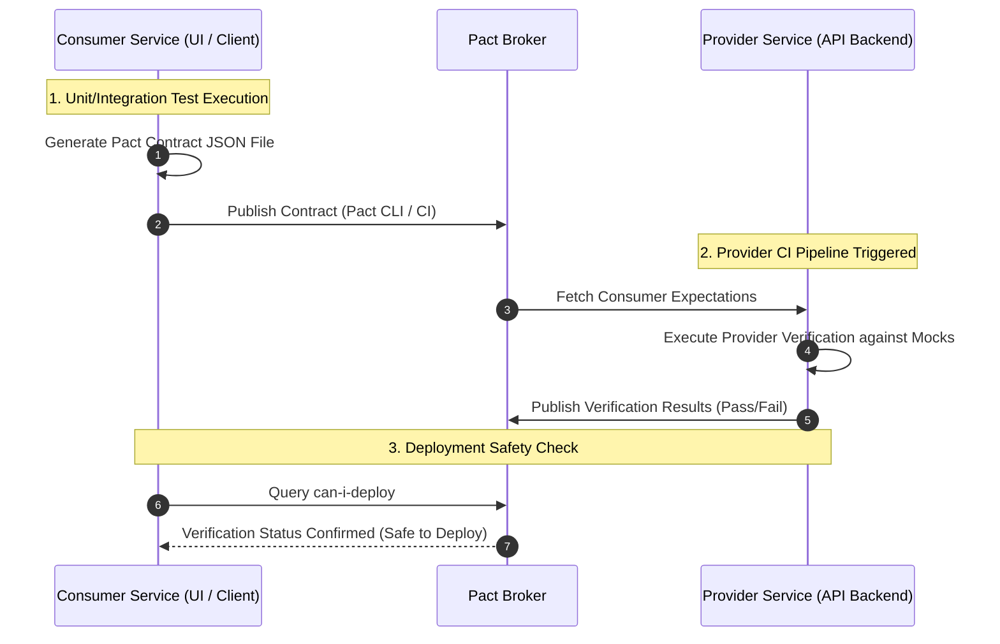

# Chapter 05: API Testing Strategy & Engineering Standard

## 5.1 API Quality Invariants

Every API developed or consumed within the platform **MUST** strictly comply with the following architecture, resilience, and security rules before its promotion to production environments:

- **Strict Schema Compliance:** Requests and responses **MUST** be formally validated against the declared contractual specification (`OpenAPI Specification (OAS)`, `GraphQL Schema Definition Language (SDL)` or `Protobuf` contracts).
    
- **Transport & Protocol Security:** All API traffic **MUST** transit exclusively over encrypted HTTPS/TLS 1.2 or higher channels.
    
- **Explicit Identity & Authorization Boundary:** APIs **MUST** validate authentication (OAuth2 / OIDC) and authorization boundaries on every request. Client applications **MUST NOT** be considered a trusted security boundary.
    
- **Prohibition of Client Password Protection Overrides:** Client applications **MUST NOT** implement local password _hashing_ or encryption functions as a replacement for credential protection on the server, unless expressly defined by an approved authentication protocol (e.g., SRP or PAKE).
    
- **Query Parameter Hygiene:** No sensitive data, session token, API key, or personally identifiable information (_PII_) **MUST** be transmitted within the URL's _Query Parameters_.
    
- **Idempotency Execution:** State modification or transactional retry methods **MUST** guarantee idempotency through dedicated headers (`Idempotency-Key`) to prevent data duplication or unwanted transactions.
    
- **Graceful Error Structure:** Error responses **MUST** return sanitized JSON structures with semantic HTTP status codes, omitting internal infrastructure details, database signatures, or uncaught _stack traces_.
    

## 5.2 API Testing Layers Model

The API automation strategy organizes validation suites into four technical isolation layers:

```
                         /  E2E Business  \
                        /   Workflows      \
                       /--------------------\
                      /   Consumer-Driven    \
                     /    Contract Testing    \
                    /--------------------------\
                   /   Functional Endpoint      \
                  /    & Integration Testing     \
                 /--------------------------------\
                /     API Component & Unit         \
               /      Validations (Mocks / Stubs)   \
              /--------------------------------------\
```

### 5.2.1 Layer Description and Isolation

- **API Component & Unit Validations:** Isolated testing at the controller or business logic level using _Mocks/Stubs_. Validates serialization, deserialization, and model validation rules without external dependencies.
    
- **Functional Endpoint & Integration Testing:** Direct testing against running services linked to databases or integrated services. Validates business logic, HTTP response codes, JSON schemas, and persistence.
    
- **Consumer-Driven Contract Testing (CDC):** Binary/structural compatibility validation between consumer and provider services without requiring complex E2E integrated environments.
    
- **E2E Business Workflows:** Sequential request chains that simulate complete end-to-end business processes, sharing transactional states through dynamic variables.
    

## 5.3 Functional Validations, HTTP Responses, and Schema Management

Every automated API testing suite **MUST** deterministically assert three response levels:

### 5.3.1 HTTP Status Code Semantics

```
                    ┌────────────────────────┐
                    │   HTTP Response Code   │
                    └───────────┬────────────┘
                                │
   ┌────────────────────────────┼────────────────────────────┐
   ▼                            ▼                            ▼
┌──────────────────┐   ┌──────────────────┐   ┌──────────────────┐
│ 2xx Success      │   │ 4xx Client Error │   │ 5xx Server Error │
└────────┬─────────┘   └────────┬─────────┘   └────────┬─────────┘
         │                      │                      │
 200 OK                  400 Bad Request        500 Internal Error
 201 Created             401 Unauthorized       502 Bad Gateway
 204 No Content          403 Forbidden          503 Service Unavail
                         404 Not Found          504 Gateway Timeout
                         409 Conflict           
                         422 Unprocessable  
                         429 Too Many Req   
```

### 5.3.2 JSON Schema Validation

API automation tools **MUST** validate the response body structure against standardized JSON schemas (`JSON Schema Draft-07` or `JSON Schema 2020-12`), ensuring data types, presence of mandatory properties, and attribute formats:

```JSON
{
  "$schema": "https://json-schema.org/draft/2020-12/schema",
  "type": "object",
  "required": ["data", "meta"],
  "properties": {
    "data": {
      "type": "object",
      "required": ["order_id", "status", "total_amount"],
      "properties": {
        "order_id": { "type": "string", "pattern": "^ORD-[0-9]{5}$" },
        "status": { "type": "string", "enum": ["PENDING", "PROCESSING", "COMPLETED"] },
        "total_amount": { "type": "number", "minimum": 0.01 }
      }
    },
    "meta": {
      "type": "object",
      "required": ["timestamp", "trace_id"],
      "properties": {
        "timestamp": { "type": "string", "format": "date-time" },
        "trace_id": { "type": "string", "format": "uuid" }
      }
    }
  }
}
```

## 5.4 Consumer-Driven Contract Testing Strategy (CDC)

To prevent regressions in microservices architectures without incurring the fragility of full integration environments, the _Consumer-Driven Contract Testing_ pattern (using tools like Pact) is adopted.

### 5.4.1 Contract Lifecycle Flow (Pact Lifecycle)



### 5.4.2 Contract Versioning and Governance Strategy

- **Consumer Responsibility:** Defines the minimum expected response requirements (interactions, parameters, and payloads) through unit tests that generate the contract artifact.
    
- **Provider Responsibility:** Verifies in its CI/CD _Pipeline_ that actual API responses satisfy the contracts published by all consumers registered in the _Pact Broker_.
    
- **Breaking Change & Versioning Protocol:** Any _Breaking Change_ **MUST** undergo:
    
    1. Explicit contract version increment in the _Pact Broker_.
    2. A consumer migration plan with an agreed _deprecation window_.
    3. Verification via the `can-i-deploy` query in the _Pipeline_ to block incompatible deployments before reaching production environments.
        

## 5.5 API Security: OWASP API Security Top 10 (2023)

API test automation **MUST** incorporate active security scenarios against the primary vulnerabilities identified by the **OWASP API Security Top 10 (2023)** standard:

| **OWASP API Vulnerability (2023)** | **Attack Vector** | **Automated Validation Strategy** |
|---|---|---|
| **API1: Broken Object Level Authorization (BOLA)** | Identifier manipulation in the URL or payload (`/v1/orders/<ORDER_ID>`) to access other users' resources. | Execute iterative requests with authentication tokens from different users/tenants and validate that the server returns `403 Forbidden` or `404 Not Found`. |
| **API2: Broken Authentication** | Manipulated, expired, malformed, or missing session tokens. | Send requests with null, expired tokens, tokens signed with invalid secret keys, or altered signatures, verifying `401 Unauthorized` responses. |
| **API3: Broken Object Property Level Authorization** | _Mass Assignment_ or excessive exposure of sensitive data in the response object. | Send unauthorized attributes in modification requests (`"is_admin": true`) and assert that the backend ignores those fields or rejects the request with `422` / `400`. |
| **API4: Unrestricted Resource Consumption** | Absence of request frequency limits (_Rate Limiting_) or list size constraints. | Inject bursts of concurrent requests to critical endpoints and verify the triggering of `429 Too Many Requests` responses. |
| **API5: Broken Function Level Authorization (BFLA)** | Regular users executing administrative endpoints (`POST /v1/admin/users`). | Switch contexts from standard role users (RBAC) to administrative URIs and validate `403 Forbidden` responses. |
| **API6: Unrestricted Access to Sensitive Business Flows** | Automated exploitation of sensitive business flows (mass account registration, continuous bookings). | Simulate loop requests to critical flows and verify the activation of restriction mechanisms (captchas, functional rate limiting, or temporary blocking). |
| **API7: Server-Side Request Forgery (SSRF)** | Requests to user-supplied URLs that force the server to query internal services. | Inject loopback/metadata IP addresses (`127.0.0.1`, `169.254.169.254`) into input URL fields and verify request blocking. |
| **API8: Security Misconfiguration** | Absence of security headers, non-allowed HTTP methods enabled, or verbose error traces. | Analyze response headers to confirm the presence of `Strict-Transport-Security`, `X-Content-Type-Options: nosniff`, and the omission of `X-Powered-By`. |

## 5.6 Sensitive Data, Masking, and Regulatory Compliance (PII & Data Masking)

In compliance with data privacy regulations (GDPR and applicable sector regulations such as DORA for financial entities):

- **Data Masking Enactment:** All _Test Datasets_ used in QA and Staging environments **MUST** undergo _Data Masking_ or synthetic generation rules.
    
- **Header & Payload Sanitization:** API test execution logging or reporting libraries **MUST** automatically sanitize authorization headers (`Authorization: Bearer <TOKEN>`), access credentials, and PII data before storing execution artifacts.
    

> To consult the test data governance and masking methodology in the delivery cycle, refer to **Chapter 01: Quality Engineering Strategy & Delivery Risk Model**.

## 5.7 API Test Architecture and Design Patterns

API test automation suites **MUST** be implemented using maintainable software design patterns:

- **API Request Facade Pattern:** Abstracts the complexity of HTTP request configuration, header injection, session management, and HTTP clients into reusable methods.
    
- **Builder Pattern:** Simplifies the construction of complex and interconnected _Payloads_ through fluent interfaces (`OrderPayloadBuilder`), facilitating the creation of mutable test objects.
    
- **Factory Method:** Dynamically builds parameterized valid and invalid input _Payloads_ for _Data-Driven Testing_.
    
- **Environment Configuration Injection:** Completely separates base URLs, credentials, and environment variables from the test source code.
    

> The detailed implementation of automation design patterns and _Custom Fixtures_ management is governed under the standards of **Chapter 09: Test Automation Architecture**.

## 5.8 API Quality Metrics

The effectiveness of API testing is quantitatively measured using the following engineering formulas:

### 1. API Contract Validation Rate (ACVR)

Percentage of endpoints whose response structure is 100% compliant with the approved schema specification:

$$\text{ACVR} = \left( \frac{\text{Endpoints with Valid Schema}}{\text{Total Evaluated Endpoints}} \right) \times 100$$

- **Measurement Objective:** Guarantee the structural integrity of the programming interface.
- **Interpretation:** An objective of $\text{ACVR} = 100\%$ is mandatory to promote the release to higher environments.
    

### 2. API Unexpected Failure Rate (AUFR)

Percentage of unhandled error responses (`5xx Internal Server Error`) detected during the execution of test suites:

$$\text{AUFR} = \left( \frac{\text{Detected 5xx Responses}}{\text{Total Executed Test Requests}} \right) \times 100$$

- **Measurement Objective:** Evaluate the robustness of the backend exception handling.
- **Interpretation:** An $\text{AUFR} > 0.5\%$ indicates vulnerabilities in the application's exception control.
    

### 3. API Business Flow Success Rate (ABFSR)

Percentage of multi-node business transactional flows successfully completed through API sequences:

$$\text{ABFSR} = \left( \frac{\text{Successful Business API Flows}}{\text{Total Executed API Flows}} \right) \times 100$$

- **Measurement Objective:** Evaluate business state consistency beyond an individual endpoint's response code.
- **Interpretation:** Allows validating if chained operations (e.g., order creation, debit, and notification) maintain the required transactional integrity.
    

> For the integration of global coverage metrics and corporate-level defect leakage analysis, refer to **Chapter 10: QA Metrics & KPIs**.

## 5.9 Reusable Blueprints

### 5.9.1 Template 01: API RBAC/BOLA Security and Contract Test Scenario

> **Central Template:** [View TC_API_BOLA_SECURITY_REUSABLE.md](../12-Templates/05-API-Testing/TC_API_BOLA_SECURITY_REUSABLE.md)

## References

- [01 - Test Strategy](../01-Test-Strategy/01 - Test Strategy.md) (Strategy and risk management)
- [02 - Test Cases](../02-Test-Cases/02 - Test Cases.md) (Test case design methodology)
- [03 - Bug Reports](../03-Bug-Reports/03 - Bug Reports.md) (Defect management and reporting)
- [09 - Test Automation](../09-Test-Automation/09 - Test Automation.md) (Automation architecture and design patterns)
- [10 - QA Metrics - KPIs](../10-QA-Metrics-KPIs/10 - QA Metrics - KPIs.md) (Quantifiable quality and performance metrics)
