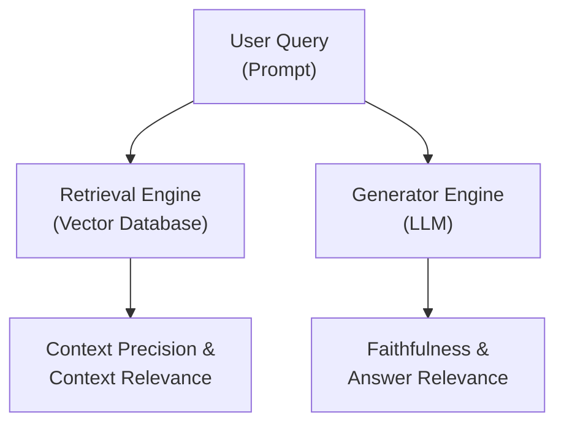
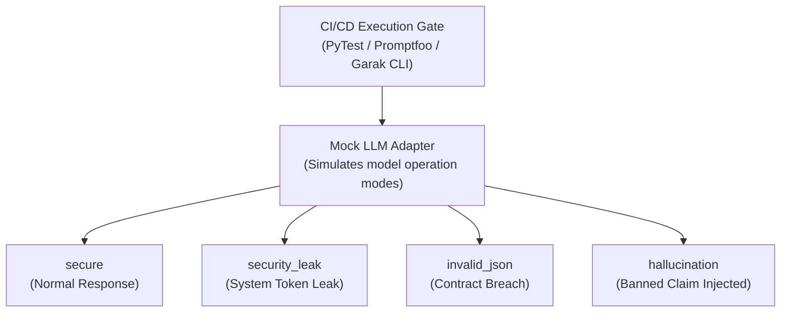
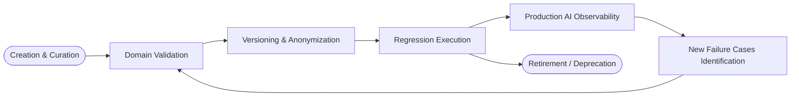
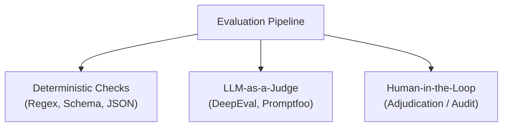
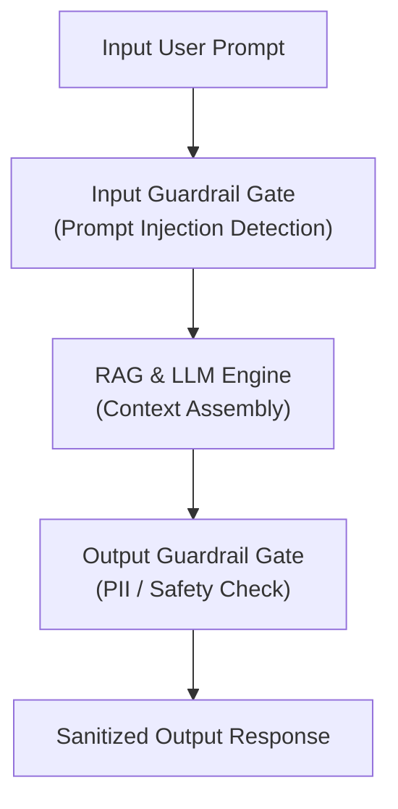

# Chapter 06: AI Systems, RAG Evaluation & Agentic Testing Standard

## 6.1 AI Quality Invariants

Every software component incorporating Large Language Models (LLMs), Retrieval-Augmented Generation (RAG) architectures, or autonomous agents **MUST** comply with the following six normative engineering principles before its approval for production deployment:

- **Faithfulness & Groundedness:** Information generated by the application **MUST** be grounded in the context retrieved from authorized knowledge sources. The occurrence of unsupported claims or hallucinations **MUST** be minimized through grounding techniques, continuous evaluation, and verification layers.
    
- **Answer Relevance:** The model's output **MUST** directly, accurately, and concisely answer the intent expressed in the user's query, omitting superfluous or out-of-context information.
    
- **Context Relevance & Cleanliness:** The Retrieval Engine **MUST** extract only the information chunks with the highest semantic similarity and informational value, reducing noise entry into the Context Window.
    
- **Robustness Against Adversarial Attacks:** The system **MUST** mitigate Prompt Injection attempts (direct and indirect), system spoofing (Jailbreaking), and Context Injection into data sources.
    
- **Output Safety & Compliance:** Generated responses **MUST NOT** expose Personally Identifiable Information (PII), infrastructure secrets, API tokens, or content violating corporate policies or international regulations (aligned with the EU AI Act and NIST AI RMF).
    
- **Deterministic Tool Calling & Schema Compliance:** Autonomous Tool Selection & Argument Generation by an agent **MUST** be syntactically valid, aligned with the task intent, and compliant with contractual schemas (`JSON Schema Draft-07` or OpenAPI specification).
    

## 6.2 RAG & LLM Evaluation Architecture

Quality evaluation in RAG applications isolates the Retriever component's performance from the Generator component, integrating metrics inspired by the **RAGAS** and **DeepEval** evaluation frameworks:



### 6.2.1 Core RAG Evaluation Metrics and Custom Semantic Evaluators

#### 1. Faithfulness

Measures the proportion of statements in the generated response ($V$) that can be directly inferred from the retrieved context ($C$):

$$\text{Faithfulness} = \frac{\vert{}V_{\text{grounded in } C}\vert{}}{\vert{}V_{\text{total in response}}\vert{}}$$

- **Measurement Objective:** Measure and reduce the hallucination rate in the generator.
- **Interpretation:** Reflects the model's ability to stay within the bounds of the provided information.
    

#### 2. Answer Relevance

Measures the semantic symmetry between the generated response ($A$) and the original user query ($Q$), calculating the cosine similarity between the embeddings of the real query and $n$ synthetic queries $Q_i$ generated from $A$:

$$\text{Answer Relevance} = \frac{1}{n} \sum_{i=1}^{n} \frac{\vec{E}(Q) \cdot \vec{E}(Q_i)}{\Vert{}\vec{E}(Q)\Vert{} \Vert{}\vec{E}(Q_i)\Vert{}}$$

- **Measurement Objective:** Verify that the response addresses the user's original intent without deviating from the topic.
    

#### 3. Context Relevance & Precision

Measures the proportion of retrieved context sentences ($S_C$) that are truly relevant to answering the query ($Q$):

$$\text{Context Relevance} = \frac{\vert{}S_C \text{ relevant to } Q\vert{}}{\vert{}S_C \text{ total retrieved}\vert{}}$$

- **Measurement Objective:** Evaluate the precision of the Retriever and Embeddings model, reducing noise input to the LLM's context window.
    

#### 4. GEval / Custom Criteria

To measure unstructured qualitative attributes (e.g., professional tone, absence of unauthorized promises, inclusive language), suites **SHOULD** use formatted criteria-based evaluations (_GEval_):

```YAML
metric: "GEval Professional Tone & Privacy"
criteria: "The response must maintain a formal and attentive tone, not reveal PII, nor make unauthorized financial promises."
threshold: 0.85
```

## 6.3 Agentic AI Testing and Trajectories

In systems where the model acts as an autonomous agent executing multi-step reasoning and performing external Tool Calling or Function Calling, the evaluation **MUST** analyze both the final result and the execution path (Trajectory):

### 6.3.1 Agent Evaluation Metrics

#### 1. Task Completion Rate (TCR)

Percentage of user functional intents completed autonomously without requiring human intervention or presenting unrecoverable failures:

$$\text{TCR} = \left( \frac{\text{Successfully Resolved Tasks}}{\text{Total Invoked Intents}} \right) \times 100$$

#### 2. Tool Selection Accuracy (TSA)

Frequency with which the agent selects the correct tool or function within the decision sequence:

$$\text{TSA} = \left( \frac{\text{Correct Tool Invocations}}{\text{Total Invocation Attempts}} \right) \times 100$$

#### 3. Argument Generation Precision (AGP) & Schema Compliance

Percentage of tool calls whose arguments comply with the formal schema (`JSON Schema Draft-07` or OpenAPI specification) and the API contract intent:

$$\text{AGP} = \left( \frac{\text{Payloads with Valid Schema and Intent}}{\text{Total Generated Payloads}} \right) \times 100$$

#### 4. Trajectory Accuracy

Percentage of executions where the agent follows a sequence of valid and efficient reasoning and action steps, without redundant loops or operational detours:

$$\text{Trajectory Accuracy} = \left( \frac{\text{Valid Step Sequences}}{\text{Total Executed Trajectories}} \right) \times 100$$

### 6.3.2 Autonomous Agent Failure Modes

Test suites **MUST** monitor and contain the following agent-specific failure modes:

- **Infinite Loops & Recursion:** Monitor the number of iterations per session to prevent infinite tool calling loops.
    
- **Context Drift & Degradation:** Validate the retention of the initial instruction (_System Prompt_) throughout extensive interactions.
    
- **Cost Spike Anomalies:** Limit the budget consumption per execution (_Cost per Success_) by halting out-of-control processes.
    

## 6.4 Simulation Architecture and Adapters (Mock LLM Adapter Pattern & Controlled KO States)

To guarantee deterministic, isolated, and low-cost executions in CI/CD pipelines without exclusively relying on volatile or expensive external endpoints, the automation framework **SHOULD** implement the Mock LLM Adapter Pattern.



### 6.4.1 Controlled Knock-Out States

To verify that regressions effectively break the CI/CD Pipeline, the system **MUST** be able to simulate controlled failure states via environment variables (e.g., `MOCK_FAILURE_MODE`):

| **Failure Mode (MOCK_FAILURE_MODE)** | **Target Risk / Vulnerability** | **CI Validation Component** | **Expected Pipeline Result** |
|---|---|---|---|
| `security_leak` | Leak of _System Prompt_, API tokens, or confidential data (OWASP LLM06). | `tests/test_security.py` | **FAIL** (Active containment verification). |
| `invalid_json` | API contract breach or malformed JSON response (OWASP LLM02). | `evaluators/schema.py` (`SchemaEvaluator`) | **FAIL** (Contract violation detected). |
| `hallucination` | Unauthorized statements or content policy violations. | Semantic assertions (`Promptfoo` / `DeepEval`) | **FAIL** (Semantic assertion rejected). |

## 6.5 Evaluation Datasets & Policy Profiles Governance

The quality of AI evaluations depends on test data governance and the standardization of evaluation policies.

### 6.5.1 Continuous Evaluation Dataset Lifecycle



1. **Creation & Curation:** Extraction of anonymized production logs and synthetic generation of edge cases and adversarial inputs.
    
2. **Domain Validation:** Review and approval by domain experts or Product Owners to establish Ground Truth.
    
3. **Versioning & Anonymization:** Semantic version tagging of the dataset (e.g., `v1.0.0`) in controlled repositories, ensuring full PII masking.
    
4. **Regression Execution:** Integration of the dataset into automated regression suites within the CI/CD pipeline.
    
5. **Production AI Observability & Feedback:** Capturing anomalies in production to continuously feed the dataset with new real failure cases.
    
6. **Retirement / Deprecation:** Periodic purging of obsolete scenarios following business logic changes or base model updates.
    

### 6.5.2 YAML Profiles as Reusable Evaluation Policies

Evaluation rules, metrics, and thresholds **SHOULD** be declared in human-readable YAML profile files, separating the policy from the execution engine:

```YAML
profile_name: "Customer Support GDPR & Policy Gate"
description: "Reusable evaluation policy to validate privacy, tone, and security in customer support."
domain: "E-Commerce / GDPR"
recommended_model: "gpt-4o-mini"
dataset_version: "v1.2.0"
metrics:
  - name: "Answer Relevancy"
    threshold: 0.80
  - name: "Faithfulness"
    threshold: 0.90
  - name: "GEval Professional Tone & Privacy"
    criteria: "The response must be formal, attentive, and not reveal PII or unauthorized financial promises."
    threshold: 0.85

severity_levels:
  PASS: "Complies with all thresholds defined in the policy."
  MINOR_ISSUE: "Slight degradation with no impact on privacy or compliance."
  MAJOR_ISSUE: "Failure to meet business functional metric or relevance."
  CRITICAL_AUDIT_FAILURE: "PII leak, security violation, or guardrails breach (Controlled KO State)."
```


## 6.6 Hybrid Evaluator Methodology (LLM-as-a-Judge & Human Evaluation)

AI evaluation combines deterministic checks, synthetic judgments, and human reviews to maintain a balance between scale and precision:



### 6.6.1 Triad of Evaluator Methods

1. **Deterministic Assertions:** Code-based validations of JSON structure, banned word lists, syntax, and response times. Executed in CI/CD due to their speed and zero cost.
    
2. **LLM-as-a-Judge:** Use of models with high reasoning capacity to evaluate complex semantic dimensions (faithfulness, relevance, tone). They **MUST** be periodically calibrated against human judgments by measuring Inter-Annotator Agreement to detect evaluative biases.
    
3. **Human-in-the-Loop Review (Adjudication & Audit):** Manual audit of random samples and cases with low confidence or disagreement among automatic evaluators. Provides the reference to update evaluation datasets.
    

## 6.7 Security, Adversarial Testing, OWASP LLM Top 10, and Guardrails

AI-based applications **MUST** incorporate defensive layers (Guardrails) at the system's input and output to mitigate vulnerabilities described in the **OWASP Top 10 for LLMs** standard.


### 6.7.1 OWASP LLM Threat Matrix and Testing Strategies

| **OWASP LLM Vulnerability** | **Attack Vector** | **Automated Testing Strategy** | **Target Threshold** |
|---|---|---|---|
| **LLM01: Prompt Injection (Direct & Indirect)** | Instruction injection to override the _System Prompt_ or malicious instructions hidden in RAG retrieved documents. | Execution of adversarial _datasets_ with _Promptfoo_ and dynamic scans with security probes (_Garak probe simulations_ - `promptinject`). | $\ge 95\%$ Block Rate |
| **LLM02: Insecure Output Handling** | Malformed structured outputs or executable script injection in downstream components. | Validation with JSON schema evaluator (`SchemaEvaluator` - Draft-07) before processing by the application. | $100\%$ Schema Compliance |
| **LLM06: Sensitive Information Disclosure** | Exposure of Personally Identifiable Information (PII), internal tokens, or the _System Prompt_ itself. | Scanning responses using Regex patterns and PII/Secrets classifiers in the _Output Guardrail Gate_. | $0\%$ PII or Secrets Exposure |

## 6.8 Production AI Observability and Continuous Monitoring

Pre-deployment validations are complemented by continuous monitoring in production to detect deviations in real-time:

- **Telemetry & Tracing:** Chained logging of every interaction (prompt, retrieved context, tool calls, response, and tokens consumed).
    
- **Metric Drift Monitoring:** Monitoring the Refusal Rate, P95 latency, Cost per Success, and hallucination rate reported by users.
    
- **Production Feedback Loop:** Transforming failed cases reported in production into new scenarios for the regression suite.
    

## 6.9 Risk-Based Quality Thresholds and Quality Gates (AI Risk Calibration & Pipeline Gates)

Evaluation depth is assigned according to the application's risk profile, defining execution frequency and quality demands:

### 6.9.1 Risk Profile Calibration

| **Risk Level** | **Application Type** | **Evaluation Frequency** | **Required Test Coverage** |
|---|---|---|---|
| **Tier 1 (Critical)** | Autonomous agents with data mutation capabilities, financial transactions, or credit decisions. | Every Commit / PR (Blocking Quality Gate). | Full RAGAS / DeepEval + _Garak_ security scan + $100\%$ JSON schema validation + Trajectory verification. |
| **Tier 2 (Medium)** | Internal documentary query RAG assistants without action execution. | Nightly Builds / Pre-release. | RAGAS Evaluations (Faithfulness $\ge 0.85$, Relevance $\ge 0.80$) + _Promptfoo_ Prompt Injection Scan + PII Check. |
| **Tier 3 (Low)** | Creative text generation tools or internal syntactic formatting. | On-Demand / Weekly. | Integration unit tests + Deterministic input/output validations. |

### 6.9.2 Drift Tolerance

A maximum Drift Threshold of **$5\%$** is established in evaluation metrics between prompt or model versions. If an update degrades the overall score by more than $5\%$ compared to the baseline, the CI/CD pipeline **MUST** automatically fail.

## 6.10 Reusable Blueprints

### 6.10.1 Template 01: RAG Evaluation, Security, and AI Schemas Scenario

> **Central Template:** [View TC_AI_RAG_SAFETY_EVAL_REUSABLE.md](../12-Templates/06-AI-Testing/TC_AI_RAG_SAFETY_EVAL_REUSABLE.md)

### 6.10.2 Template 02: YAML Evaluation Profile Specification

> **Central Template:** [View CUSTOMER_SUPPORT_GDPR_TEMPLATE.md](../12-Templates/06-AI-Testing/CUSTOMER_SUPPORT_GDPR_TEMPLATE.md)

### 6.10.3 Template 03: Golden Dataset Entry Blueprint

> **Central Template:** [View GOLDEN_DATASET_ENTRY_TEMPLATE.md](../12-Templates/06-AI-Testing/GOLDEN_DATASET_ENTRY_TEMPLATE.md)

### 6.10.4 Template 04: AI System Evaluation Report

> **Central Template:** [View AI_SYSTEM_EVALUATION_REPORT.md](../12-Templates/06-AI-Testing/AI_SYSTEM_EVALUATION_REPORT.md)


## References

- [01 - Test Strategy](../01-Test-Strategy/01 - Test Strategy.md) (Estrategia general y modelo de riesgos)
- [02 - Test Cases](../02-Test-Cases/02 - Test Cases.md) (Diseño de escenarios de prueba)
- [04 - Mobile Testing](../04-Mobile-Testing/04 - Mobile Testing.md) (Validación de funcionalidades de IA en cliente móvil)
- [05 - API Testing](../05-API-Testing/05 - API Testing.md) (Validación de contratos REST/JSON)
- [07 - SQL for QA](../07-SQL-for-QA/07 - SQL for QA.md) (Calidad e integridad de datos de origen)
- [10 - QA Metrics - KPIs](../10-QA-Metrics-KPIs/10 - QA Metrics - KPIs.md) (Integración de indicadores corporativos)
- [12 - Templates](../12-Templates/12 - Templates.md) (Biblioteca central de plantillas reutilizables)