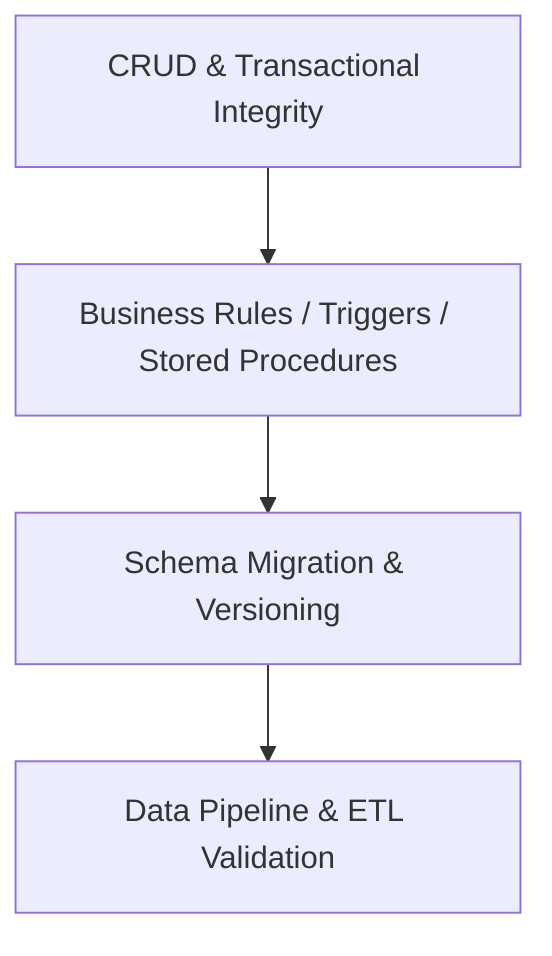
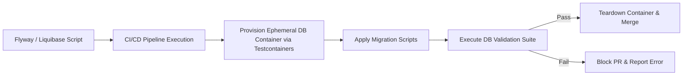

# Chapter 07: SQL, Persistence Validation & Data Integrity Testing Strategy

## 7.1 Data Integrity Core Invariants

Every data reading or modification interaction at the persistence layer (SQL relational databases) **MUST** comply with the following five normative principles before validating the approval of a feature or data migration:

- **Referential Integrity & Constraints Enforcement:** No application operation **MUST** generate orphan records in relational models where referential integrity is defined. The persistence layer **MUST** strictly enforce primary keys (`Primary Key`), foreign keys (`Foreign Key`), non-null values (`NOT NULL`), unique values (`UNIQUE`), and validation rules (`CHECK`).
    
- **ACID & Transaction Isolation Guarantees:** Operations that modify multiple tables or records **MUST** be executed within atomic transactions. Upon any failure in an intermediate step, the system **MUST** perform a full `ROLLBACK`. Concurrency tests **MUST** verify that the Isolation Level prevents Dirty Reads, Non-repeatable Reads, and Deadlocks.
    
- **Data Privacy & Governance (Zero Unprotected PII):** Data processed or queried in QA, Staging, or analytical environments **MUST NOT** contain Personally Identifiable Information (PII) or credentials in plain text. Any dataset derived from production **MUST** undergo irreversible anonymization, pseudonymization via protected mapping mechanisms, or Data Masking according to the data sensitivity classification (see **Chapter 01: Quality Engineering Strategy & Delivery Risk Model**).
    
- **Schema Migration Determinism:** Database migrations (`DDL scripts`, versioning tools like Liquibase or Flyway) **MUST** be idempotent, deterministic, and reversible through validated rollback scripts before their application in higher environments.
    
- **Query Performance & Resource Consumption:** Application and QA validation queries **MUST NOT** perform unintended Full Table Scans on high-volume tables, respecting defined indexes to prevent resource contention or locks (Table/Row Locks).
    

## 7.2 Data Layer Testing Strategy

The persistence layer validation strategy isolates data components into four technical verification levels:



### 7.2.1 Persistence Layers Description

- **CRUD & Transactional Integrity:** Direct validation that business operations initiated from the application or API persist the correct values in the corresponding tables, applying domain boundaries and atomic transactions.
    
- **Business Rules / Triggers / Stored Procedures:** Validation of the business logic embedded in the database engine via triggers, functions, and stored procedures, evaluating states before and after execution.
    
- **Schema Migration & Versioning:** Verification of structure scripts deployment (`DDL`) in CI/CD pipelines, ensuring Backward/Forward Compatibility.
    
- **Data Pipeline & ETL Validation:** Verification of Extract, Transform, and Load (ETL) processes, ensuring record completeness, lossless transformations, and consistency between source and destination systems.
    

## 7.3 Data Validation Techniques Matrix

To systematically cover the persistence layer, the following SQL query and assertion techniques are applied:

| **SQL Validation Technique** | **Query Approach** | **Core Use Cases** | **Engineering Objective** |
|---|---|---|---|
| **Referential Integrity Check** | `LEFT JOIN ... WHERE foreign_key IS NULL` | Detection of orphan records between parent and child entities. | Guarantee that foreign key constraints have not been bypassed. |
| **Data Completeness & Reconciliation** | `COUNT(*)`, `SUM()`, `CHECKSUM_AGG()` | Validation of migrations or massive load processes. | Confirm that 100% of the required records were transferred without loss. |
| **Boundary & Domain Constraint Check** | `WHERE column NOT BETWEEN min AND max` | Auditing of numerical values, states, or out-of-norm ranges. | Detect writes of corrupted data or application validation bypasses. |
| **Uniqueness & Duplicate Detection** | `GROUP BY column HAVING COUNT(*) > 1` | Verification of columns with uniqueness constraints or unique indexes. | Prevent or identify unauthorized duplications in business records. |
| **Null Safety & Mandatory Fields** | `WHERE mandatory_column IS NULL` | Integrity auditing in fields defined as logically required. | Avoid errors in object deserialization at the application layer. |
| **Transaction Isolation Testing** | `SELECT ... FOR UPDATE`, `COMMIT`, `ROLLBACK` | Validation of concurrency, locks, and transactional isolation. | Detect inconsistencies derived from simultaneous accesses to the same entity. |

## 7.4 QA Software Quality SQL Pattern Reference

### 7.4.1 Referential Integrity Validation and Orphan Detection

Identifies if there are registered transactions without a valid associated parent entity:


```SQL
SELECT 
    t.transaction_id, 
    t.account_id, 
    t.created_at
FROM transactions t
LEFT JOIN accounts a ON t.account_id = a.account_id
WHERE a.account_id IS NULL;
```

### 7.4.2 Duplicate Detection in Logical Uniqueness Violation

Evaluates the presence of multiple active records for a unique business key:

```SQL
SELECT 
    customer_id, 
    identity_document, 
    COUNT(*) AS duplicate_count
FROM customers
WHERE status = 'ACTIVE'
GROUP BY customer_id, identity_document
HAVING COUNT(*) > 1;
```

### 7.4.3 Transactional Totals Reconciliation (Data Reconciliation)

Compares the sum of movements in the Ledger Table against the consolidated account balance (assuming the transactions table stores the entire movement history):

```SQL
SELECT 
    a.account_id,
    a.current_balance,
    COALESCE(SUM(t.amount), 0.00) AS calculated_balance,
    (a.current_balance - COALESCE(SUM(t.amount), 0.00)) AS variance
FROM accounts a
LEFT JOIN transactions t ON a.account_id = t.account_id AND t.status = 'COMPLETED'
WHERE a.account_id = <TARGET_ACCOUNT_ID>
GROUP BY a.account_id, a.current_balance
HAVING ABS(a.current_balance - COALESCE(SUM(t.amount), 0.00)) > 0.01;
```

## 7.5 Database Test Automation and CI/CD Integration

Database validations **MUST** be part of the continuous regression suite through automated tests (using tools like `Testcontainers`, Flyway/Liquibase validation and callbacks, `pgTAP`, or `dbUnit`):



### 7.5.1 Environment Isolation via Ephemeral Containers

To prevent state contamination between tests and ensure repeatable executions:

- Database test suites **MUST** run on ephemeral container instances instantiated dynamically via `Testcontainers` or isolated Docker services in the CI/CD runner.
    
- Base test data (_fixtures_) **MUST** be loaded through deterministic `SEED` scripts in the Setup phase and destroyed in the Teardown phase.
    

## 7.6 Test Data Governance and Masking (Data Masking Governance)

To comply with data privacy regulations (GDPR, DORA, and sector regulations):

- **Data Protection Categorization:** Database test environments derived from production copies **MUST** undergo a transformation process according to the data type:
    
    - **Anonymization:** Irreversible transformation for data that does not require reconstruction.
        
    - **Pseudonymization:** Replacement of identifiers with pseudonyms or tokens whose correspondence with original data is preserved through custody and access control mechanisms.
        
    - **Data Masking:** Visual or structural obfuscation for test execution without revealing real data.
        
- **Substitution Standards:**
    
    - First and Last Names $\rightarrow$ Synthetic generation of standardized names (`User_<HASH>`).
        
    - Email Addresses $\rightarrow$ Transformation to test domains (`user_<ID>@test.domain.internal`).
        
    - Identity Documents / PII $\rightarrow$ Masking with fixed characters (`******123X`).
        
    - Passwords / Credential Hashes $\rightarrow$ Replacement with standardized test environment hashes.
        

## 7.7 Data Integrity Quality Metrics

The quality of the data layer and its migration processes is measured by the following engineering formulas:

### 1. Data Reconciliation Success Rate (DRSR)

Percentage of successfully reconciled records between source and destination during a migration or ETL process:

$$\text{DRSR} = \left( \frac{\text{Successfully Validated Records}}{\text{Total Migrated Records}} \right) \times 100$$

- **Measurement Objective:** Guarantee the absence of data loss or corruption in massive transfers.
- **Interpretation:** A value of $\text{DRSR} = 100\%$ is required for migration approval.
    

### 2. Orphan Record Index (ORI)

Proportion of orphan records identified in dependent tables relative to the total processed records:

$$\text{ORI} = \left( \frac{\text{Records Without Valid Parent}}{\text{Total Records in Child Table}} \right) \times 100$$

- **Measurement Objective:** Measure referential integrity degradation in the database.
- **Interpretation:** An $\text{ORI} > 0\%$ indicates failures in foreign key constraints or deficient cleanup.
    

### 3. Schema Migration Failure Rate (SMFR)

Percentage of migration DDL script executions that result in errors during the deployment phase in CI/CD pipelines:

$$\text{SMFR} = \left( \frac{\text{Failed DDL Migrations}}{\text{Total Executed Migrations}} \right) \times 100$$

- **Measurement Objective:** Evaluate the determinism and idempotency of database versioning scripts (Flyway/Liquibase).
- **Interpretation:** A value of $\text{SMFR} = 0\%$ is essential to guarantee stable continuous delivery pipelines.
    

### 4. Data Defect Escape Rate (DDER)

Percentage of defects associated with data corruption, inconsistency, or schema failures detected in the production environment:

$$\text{DDER} = \left( \frac{\text{Data Defects in Production}}{\text{Total Detected Data Defects}} \right) \times 100$$

- **Measurement Objective:** Measure the effectiveness of regression and integrity testing in lower layers.
- **Interpretation:** A target value of $\text{DDER} < 5\%$ ensures high containment of data failures before release.
    

## 7.8 Reusable Blueprints

### 7.8.1 Template 01: SQL Referential and Transactional Integrity Test Scenario

> **Central Template:** [View TC_SQL_INTEGRITY_REUSABLE.md](12-Templates/07-SQL-for-QA/TC_SQL_INTEGRITY_REUSABLE.md)

---

## References

- [01 - Test Strategy](01%20-%20Test%20Strategy.md) (Test strategy and risk model)
- [02 - Test Cases](02%20-%20Test%20Cases.md) (Test case design methodology)
- [03 - Bug Reports](03%20-%20Bug%20Reports.md) (Defect management and reporting)
- [05 - API Testing](05%20-%20API%20Testing.md) (Contract testing and API integration)
- [10 - QA Metrics - KPIs](10%20-%20QA%20Metrics%20-%20KPIs.md) (Quality and performance metrics)
