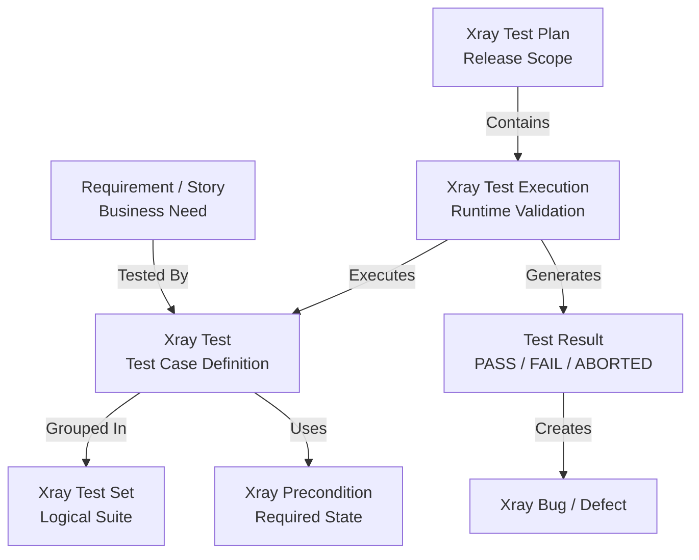
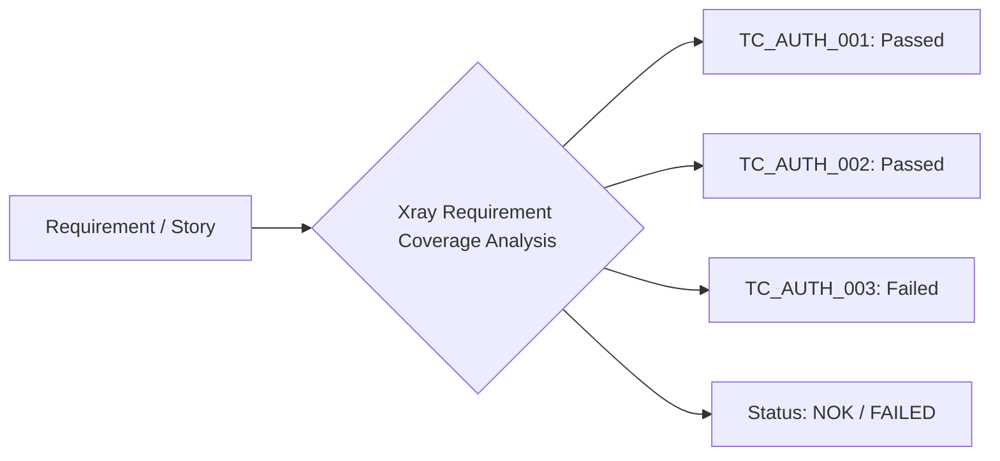
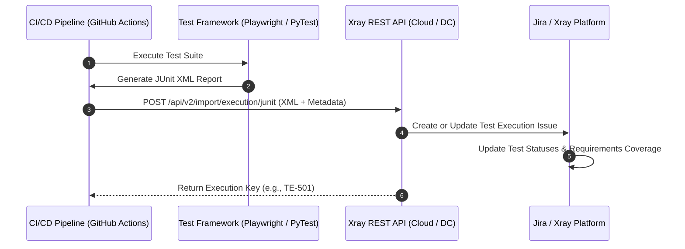

# Chapter 08: Jira & Xray Integration for QA Governance & Traceability

## 8.1 ALM Governance Quality Invariants

Every software project configured in the Application Lifecycle Management (ALM) platform, composed of Jira Software and the Xray Test Management extension, **MUST** comply with the following normative principles of governance and traceability:

* **End-to-End Bidirectional Traceability:** Every test scenario (*Test*) registered in Xray **MUST** be explicitly linked to a valid requirement artifact (*Story*, *User Story*, *Requirement*, *Epic*) through coverage relationships. Likewise, defects (*Bugs*) detected during executions **MUST** maintain bidirectional links to the specific run, the test case, and the affected user story to evaluate immediate business impact.
* **Controlled Issue Type Usage & Governance:** Engineering teams **MUST** exclusively use the issue types (*Issue Types*) standardized by the organization (`Test`, `Test Set`, `Test Execution`, `Test Plan`, `Precondition`, `Bug`). The creation of custom issue types related to test or quality management **MUST** require formal approval from the QA Governance team.
* **Deterministic Status Transition:** Test executions (*Test Executions*) **MUST** reflect the real validation status in real-time. No requirement ticket or user story classified as business-critical (*Tier 1 Critical*) **MUST** be promoted to `Done` or `Ready for Release` status if it has associated tests in `FAIL`, `ABORTED`, or unexecuted (`TODO`) statuses.
* **Data Protection & Evidence Sanitization in Attachments:** All evidence attached in Xray executions or defect reports (*Logs*, *Screenshots*, network payloads) **MUST** comply with the Personally Identifiable Information (*PII*) masking and credential/token sanitization standards defined in **Chapter 01: Quality Engineering Strategy & Delivery Risk Model**.
* **Automated Result Synchronization:** Automated test executions in CI/CD *pipelines* **MUST** import their results into Xray via the official Xray REST APIs or integration plugins, using stable Test identifiers (`Test Key`) to prevent massive artifact duplication.

---

## 8.2 Xray Data Model & Issue Hierarchy

The Xray data model extends Jira Software's native capabilities to structure test management into a declarative relational hierarchy. Jira and Xray operate as the orchestration, governance, and test traceability platform (ALM operating system), while the actual execution of automation code resides in CI/CD pipelines and source code repositories.




### 8.2.1 Entity Definition and Responsibilities

* **Requirement / Story:** Source functional artifact (*Jira Story, Epic, Requirement*) representing a business need or product capability. It defines the context that must be validated and constitutes the starting point of quality traceability.

* **Test (Issue Type: Test):** Primary test definition artifact. Describes what behavior must be validated via execution steps, test data, associated preconditions, and expected results. Represents the validation intent regardless of when or where it is executed. It can be of type `Manual`, `Generic` (automation integration), or `Cucumber`.

* **Test Set (Issue Type: Test Set):** Logical grouping of test cases (*Tests*) used to organize and reuse validation sets based on functional, technical, or risk criteria. Examples: regression suites, system components, or categories like `@Smoke` and `@Regression_API`.

* **Precondition (Issue Type: Precondition):** Reusable artifact defining the required state before executing one or more *Tests*. It centralizes common conditions such as initial data, environment configuration, user permissions, or specific business entity states.

* **Test Plan (Issue Type: Test Plan):** Governance artifact associated with a version, delivery, or strategic initiative. It defines the overall validation scope by consolidating multiple *Test Executions*, allowing the assessment of Release readiness and coverage level.

* **Test Execution (Issue Type: Test Execution):** Represents a specific test run within a given context (*Environment*, *Build Version*, *Sprint*, or *Release*). It records when, where, and under what conditions the *Tests* were executed, storing the results obtained during validation.

* **Test Result:** Result generated during a specific execution of a *Test*. Represents the final validation state (`PASS`, `FAIL`, `ABORTED`, `TODO`) and constitutes the operational evidence used to determine product quality and trigger subsequent analysis processes.

* **Bug / Defect:** Incident created as a consequence of a failed result or unexpected behavior detected during an execution. It maintains traceability to the *Test Result*, the associated execution, and the affected requirement to facilitate impact analysis and resolution (see **Chapter 03: Bug Report Engineering Standard & Governance**).

---

## 8.3 Jira/Xray Naming Conventions and Metadata

To ensure consistency, agile searching, and filtering of artifacts using JQL (*Jira Query Language*), every registered element **MUST** follow these conventions:

### 8.3.1 Title Naming (Summary Standard)

Test case titles **MUST** describe the condition or expected result, avoiding generic action verbs like "Validate" or "Verify" at the beginning.

| Xray Entity | Title Structure (Summary) | Practical Example |
| --- | --- | --- |
| **Test** | `[TC]_[MODULE]_[COMPONENT]_[CONDITION_OR_EXPECTED_RESULT]` | `TC_AUTH_LOGIN_User_Locked_After_Three_Invalid_Attempts` |
| **Precondition** | `[PRE]_[MODULE]_[REQUIRED_STATE_DESCRIPTION]` | `PRE_AUTH_001_User_Account_Active_With_Sufficient_Balance` |
| **Test Set** | `[TS]_[MODULE/SUITE]_[TEST_TYPE]_[ENVIRONMENT]` | `TS_CHECKOUT_Regression_Suite_Staging` |
| **Test Execution** | `[TE]_[SPRINT/RELEASE]_[SUITE]_[ENV]_[BUILD_ID]` | `TE_SPRINT_42_Regression_API_Staging_Build_1042` |
| **Test Plan** | `[TP]_[PROJECT]_[RELEASE_VERSION]` | `TP_MOBILE_APP_Release_v3.2.0` |

### 8.3.2 Mandatory Test Metadata Standard

To prevent saturation of the free `Labels` field, test governance metadata **MUST** be structured between formal *Custom Fields* and generic *Labels*:

| Test Metadata | Jira / Xray Field | Field Type | Allowed Values / List |
| --- | --- | --- | --- |
| **Automation Status** | Custom Field | Select List | `Automated`, `Manual_Candidate`, `Manual_Only` |
| **Test Layer** | Custom Field | Select List | `UI_Web`, `Mobile_iOS`, `Mobile_Android`, `API_REST`, `Database` |
| **Risk Category** | Custom Field | Select List | `Business_Critical`, `Financial_Impact`, `Security_Compliance`, `Operational` |
| **Test Scope** | Labels | Multi-Label | `Smoke`, `Sanity`, `Regression`, `E2E` |

---

## 8.4 Requirements Coverage Analysis

The Xray coverage analysis engine quantitatively evaluates the readiness status of a user story before its authorization for *Release* or deployment.



### 8.4.1 Normative Requirement Coverage Criteria

* **Requirement Coverage Status:** The coverage status of a *Story* is automatically calculated based on the result of linked *Tests* in the context of a selected environment or version:
* **OK (Passed):** All linked *Tests* are in `PASS` status.
* **NOK (Failed):** At least one linked *Test* is in `FAIL` status.
* **NOT RUN:** There are linked *Tests*, but they have not been executed in the evaluated scope.
* **UNCOVERED:** The *Story* has no linked *Tests*.


* **Critical Requirement Release Readiness Gate:** No business requirement classified as critical (*Tier 1 Critical*) **MUST** be promoted to `Done` status or authorized for *Release* if its *Requirement Coverage Status* in Xray differs from `OK (Passed)`. Non-critical requirements with `NOK` or `NOT RUN` status **MUST** require explicit approval from the *Product Owner* and the *QA Lead* through a documented risk agreement.

---

## 8.5 Test Environment Governance in Xray

To guarantee the integrity of execution metrics in heterogeneous architectures, test executions (*Test Executions*) **MUST** be explicitly parameterized using Xray's native **Test Environments** field.

### 8.5.1 Environment Cataloging Rules

* **Environment Disambiguation:** Each *Test Execution* **MUST** be tagged with the exact environment where the suite was executed (e.g., `DEV`, `QA`, `STAGING-EU`, `PRE-PROD`, `PROD-LIKE`).
* **Mobile & Cross-Browser Dimension:** In mobile or web executions, the environment tag **MUST** incorporate the combination of operating system, browser, or device (e.g., `Android_15_Pixel8`, `iOS_18_iPhone15`, `Chrome_128_Windows11`).
* **Isolated Metrics Calculation:** Requirement coverage views and executive dashboards **MUST** be filtered by the corresponding environment to prevent failures in local development environments or `DEV` from contaminating the quality status of the candidate version in `STAGING` or `PRE-PROD`.

---

## 8.6 Evidence Management Standard

Every executed test case (manual or automated) whose run finishes in `FAIL`, `ABORTED`, or `BLOCKED` status **MUST** attach sanitized technical evidence in the Xray execution log (*Test Run*).

### 8.6.1 Evidence Content Standard

Attached evidence **MUST** contain the following metadata structure:

* **Timestamp UTC:** Exact date and time of the failure.
* **Environment & Build ID:** Execution environment and *Build* number / *Commit Hash*.
* **Test Execution Key:** Xray execution identifier (e.g., `TE-1042`).
* **Traceability References:** Annotated screenshots, console logs (*Console Logs*), screen recordings, or APM traces (`Correlation-ID` / `Trace-ID`).
* **PII & Token Sanitization:** Mandatory sanitization of authorization headers (`Authorization: Bearer <TOKEN>`) and masking of personal data in attached images and *payloads*.

---

## 8.7 Automated Execution Flow and CI/CD Pipelines Integration

Xray integrates with CI/CD pipelines (GitHub Actions, GitLab CI, Jenkins) to automatically synchronize execution results from frameworks like Playwright, Cypress, Appium, PyTest, or JUnit.



### 8.7.1 Import Methods and API Differences

> **Architecture Note:** REST API *endpoints* and authentication differ based on the Xray deployment model.

* **Xray Cloud API Base URL:** `[https://xray.cloud.getxray.app/api/v2](https://xray.cloud.getxray.app/api/v2)` (Authentication via Bearer Token using Client ID/Secret).
* **Example Endpoint Xray Server / DC API Base URL:** `https://<JIRA_DOMAIN>/rest/raven/1.0` (Authentication via Personal Access Token or Basic Auth).
* **Compatible Import Formats:**
* `POST /import/execution/junit`: Standard import of JUnit XML reports.
* `POST /import/execution/cucumber`: Import of Cucumber JSON reports for BDD.
* `POST /import/execution`: Import of Xray JSON format for advanced injection of steps and iterations.


---

## 8.8 QA Audit Governance JQL Queries

QA leads and auditors **MUST** use advanced JQL queries (*Jira Query Language*) to monitor the health of the test repository. *(Note: Xray-specific JQL functions may vary depending on the deployment version and environment).*

### 1. Uncovered Critical Requirements

```jql
issueIn RequirementCoverage("UNCOVERED") AND priority IN ("P0-Critical", "P1-High") AND status NOT IN ("Closed", "Done")

```

### 2. Automated Test Cases with Failed Status in Last Execution

```jql
issuetype = "Test" AND "Automation Status" = "Automated" AND testStatus("FAIL")

```

### 3. Open Defects Linked to Critical Regression Tests (Tier 1)

```jql
issuetype = Bug AND status NOT IN (Closed, Resolved) AND issueFunction in linkedIssuesOf("cf[10100] = 'Business_Critical'", "is caused by")

```

---

## 8.9 Reusable Blueprints

### 8.9.1 Template 01: Bash Script for Importing JUnit Results to Xray Cloud with Retries

> **Central Template:** [View XRAY_JUNIT_IMPORT.md](12-Templates/08-Jira-Xray/XRAY_JUNIT_IMPORT.md)

### 8.9.2 Template 02: GitHub Actions Workflow Configuration for Automatic Synchronization with Xray

> **Central Template:** [View XRAY_SYNC_WORKFLOW.md](12-Templates/08-Jira-Xray/XRAY_SYNC_WORKFLOW.md)

---

## References

- [01 - Test Strategy](01%20-%20Test%20Strategy.md) (Entry/exit criteria and quality gates)
- [02 - Test Cases](02%20-%20Test%20Cases.md) (Design standards and test case metadata)
- [03 - Bug Reports](03%20-%20Bug%20Reports.md) (Lifecycle and defect management)
- [09 - Test Automation](09%20-%20Test%20Automation.md) (Automation integration and reporting)
- [10 - QA Metrics - KPIs](10%20-%20QA%20Metrics%20-%20KPIs.md) (Corporate quality metrics and coverage)
