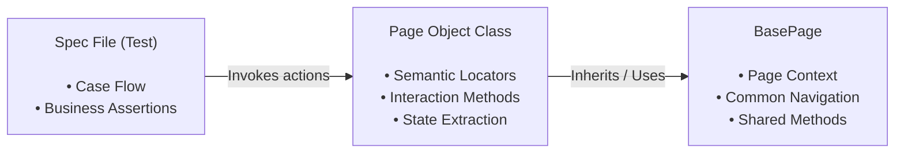

# Chapter 09: Test Automation Architecture, Design Patterns & Engineering Standards

## 9.1 Test Automation Architecture Core Invariants (Automation Invariants)

Every automation solution developed for E2E, integration, or user interface test suites **MUST** comply with the following normative software engineering principles:

- **Strict Separation of Concerns (SOC):** The interaction logic with the interface or API contracts **MUST** be kept isolated from the assertion and test flow logic. Test files (_spec files_) **MUST NOT** contain direct DOM selectors, explicit URL constructions, or network protocol implementation details.
    
- **Determinism and Total Isolation:** Each automated test case **MUST** be independent and executable in arbitrary order or in parallel without state dependencies generated by preceding tests. The Setup and Teardown phases **MUST** guarantee the required initial state via fixtures or direct API calls.
    
- **Prohibition of Unconditional Waits:** The use of static and unconditional pauses (`sleep`, `Thread.sleep`, `wait(1000)`) **MUST NOT** be introduced into the automation code. State synchronization **MUST** rely on event-based mechanisms or conditional state assumptions of the tool (_explicit polling_, _auto-waiting_).
    
- **Semantic Locators and Invariants against UI Changes:** Interface element selectors **MUST** prioritize explicit semantic attributes designed for testing (`data-testid`, `test-id`, accessibility roles `getByRole`). The use of absolute XPaths, CSS classes coupled to visual styles, and selectors based on the positional DOM tree is prohibited.
    
- **Centralized Configuration and Secrets Management:** Any environment variable, base URL, credentials, or tokens **MUST** be injected via environment variables at runtime (`.env`, pipeline secrets). No credential or secret **MUST** be hardcoded into the code repository.
    
- **Execution Observability and Automatic Failure Evidence:** Every automated execution in local or CI/CD environments **MUST** automatically capture and attach sufficient diagnostic artifacts upon a `FAIL` state (annotated screenshots, execution traces, videos, and system log/logcat dumps) to allow remote analysis without requiring manual reproduction.
    

## 9.2 Test Automation Design Patterns

### 9.2.1 Page Object Model (POM) with Base Inheritance

The _Page Object Model_ pattern abstracts web pages or user interface components into classes or objects that expose interaction services. The use of an abstract base class (`BasePage`) is promoted to centralize browser context initialization and common interface operations.



#### POM Implementation Rules:

1. **Class Attributes:** Expose DOM elements using getters or read-only properties that return lazily evaluated locators.
    
2. **Flow Encapsulation:** Page methods **MUST** perform complex user operations (e.g., `loginAs(username, password)`) and return the resulting page object to allow fluent interfaces or maintain contextual navigation.
    
3. **Absence of Business Assertions:** POM classes **MUST NOT** include business domain test assertions (`expect`, `assert`), limiting their scope to interaction and state extraction. Assertions **MUST** remain exclusively in the _spec file_.
    

### 9.2.2 Facade Pattern

The Facade pattern provides a unified, high-level interface over a complex set of interactions spanning multiple pages, components, or API calls, simplifying the execution of end-to-end transactional flows.

#### Normative Use Case:

Used to encapsulate multi-domain sequences (e.g., account preparation, API authentication, product selection in UI, and checkout processing). The facade exposes a single method (e.g., `shopFacade.purchaseProduct(productDetails)`) that abstracts the complexity of the underlying orchestration.

### 9.2.3 Factory Pattern (Data and Object Factory)

The Factory pattern centralizes the creation of dynamic test data or domain objects, ensuring model consistency and allowing parametric overrides according to specific test needs.

#### Factory Implementation Rules:

1. **Valid Default Values:** The factory **MUST** generate syntactically valid data objects using deterministic generators or standardized data libraries.
    
2. **Override Support:** The creator function **MUST** accept a partial override object to allow adjusting specific attributes without forcing the definition of the entire entity in the _spec file_.
    

### 9.2.4 Strategy Pattern

The Strategy pattern allows dynamically alternating the execution mechanism of an action (e.g., UI authentication vs. OAuth API authentication, or credit card payment vs. bank transfer) under a common interface at runtime.

### 9.2.5 Singleton Pattern (Stateless Infrastructure and Client Management)

The Singleton pattern guarantees a single global instance for infrastructure clients or stateless services, such as database connections, reusable HTTP clients, or environment variable managers.

#### Usage Restrictions in Multi-thread / Worker Environments:

- **Prohibition of UI State:** The Singleton pattern **MUST NOT** be used to store UI state, `Page` instances, or browser contexts.
    
- **Isolation in Execution Workers:** In frameworks with parallelization based on independent processes or workers (e.g., Playwright), Singleton instances **MUST** be strictly scoped to each worker to avoid race conditions and shared memory contamination.
    

### 9.2.6 Data-Driven Testing (DDT)

The Data-Driven Testing pattern completely separates the executable test code from the input data set and expected results, iterating in a parameterized manner over JSON structures, CSV files, or data tables to validate repetitive scenarios with multiple inputs.

## 9.3 Dependency Injection, Custom Fixtures, and Infrastructure Contexts

### 9.3.1 Custom Fixtures and Multi-Layer Dependency Injection

Automation suites **MUST** extend the native execution contexts of the tool (e.g., `test.extend` in Playwright) to inject initialized instances of Page Objects, fallback API clients, database utilities, and data factories. This eliminates boilerplate instantiation in specification files and guarantees a decoupled architecture.


```TypeScript
// Multi-layer Test Fixtures Extension with Dependency Injection
import { test as base } from '@playwright/test';
import { LoginPage } from './pages/LoginPage';
import { InventoryPage } from './pages/InventoryPage';
import { UserFactory } from './factories/UserFactory';

type FrameworkFixtures = {
  loginPage: LoginPage;
  inventoryPage: InventoryPage;
  testUser: ReturnType<typeof UserFactory.createUser>;
};

export const test = base.extend<FrameworkFixtures>({
  loginPage: async ({ page }, use) => {
    await use(new LoginPage(page));
  },
  inventoryPage: async ({ page }, use) => {
    await use(new InventoryPage(page));
  },
  testUser: async ({}, use) => {
    const user = UserFactory.createUser();
    await use(user);
  },
});

export { expect } from '@playwright/test';
```

### 9.3.2 State Isolation and Session Injection (State Storage)

- **UI Authentication Bypass:** Tests that do not directly evaluate the login flow **MUST** bypass UI authentication, injecting session states (`storageState`, cookies, JWT) directly through HTTP requests in the initialization phase (`beforeAll` / _global setup_).
    
- **Database and Cleanup:** The state generated in the database **MUST** be explicitly cleaned using Teardown hooks or isolated by executing transactions on ephemeral containers (see **Chapter 07: SQL & Data Integrity Testing Strategy**).
    

## 9.4 Continuous Auditing Integration: Web Accessibility and Native Dialog Handling

### 9.4.1 Automated Accessibility Auditing (Shift-Left Accessibility)

Web accessibility verification (WCAG 2.0/2.1 Level A and AA) **MUST** be integrated directly into the automation framework using automated scanning engines (e.g., `@axe-core/playwright`), allowing early detection of structural violations.

#### Accessibility Scanning Execution Rules:

1. **Standard Rules:** Each automated scan **MUST** be evaluated against the `wcag2a` and `wcag21aa` tags.
    
2. **Failure Criteria:** The suite **MUST** fail if violations with `Critical` or `Serious` impact level are detected.
    
3. **Declarative Exclusions:** Defects previously identified in the remediation queue **MUST** be explicitly filtered using excluded selectors in the scanner configuration, linking each exclusion to an active defect ticket (see **Chapter 03: Bug Reports**).
    
4. **Certification Scope:** Automated scanning tools only verify a subset of WCAG rules (approximately 30%-40%). Therefore, automated scans **SHOULD NOT** be interpreted as full accessibility certification without complementary manual or assisted testing.
    

### 9.4.2 Native Browser Dialog Interception and Validation

The framework **MUST** provide mechanisms to intercept, validate, and respond to native browser events (_JavaScript Alerts_, _Prompts_, _Confirmations_) using asynchronous event listeners instantiated before triggering the action that activates the dialog.

## 9.5 Locator Strategy Standard

Element selection **MUST** conform to the following strict stability hierarchy:

| **Priority** | **Locator Type** | **Example / Pattern** | **Justification / Criterion** |
|---|---|---|---|
| **1 (Preferred)** | Explicit test attribute | `page.getByTestId('submit-button')` | Invariant to styling, layout, or internationalization changes. |
| **2 (Accessible)** | Explicit accessibility role | `page.getByRole('button', { name: 'Submit' })` | Validates the accessible DOM structure and native behavior. |
| **3 (Text/Label)** | Visible text or label | `page.getByLabel('Username')` | Reflects the end-user's visual perception. Use with caution if i18n is present. |
| **4 (CSS Alt)** | Functional semantic CSS | `page.locator('input[name="user-email"]')` | Acceptable if the HTML property is a standard semantic contract. |
| **Prohibited** | Absolute XPath / Positional CSS | `/html/body/div[2]/div[1]/button` | Highly fragile. Fails upon any HTML structural modification. |

## 9.6 Environment-based Execution Strategy and Test Data Governance

### 9.6.1 Automated Test Execution Matrix per Environment

The depth and scope of automation scripts **MUST** adapt to the target deployment environment to optimize the feedback loop speed:

| **Target Environment** | **Automated Suite Type** | **Trigger** | **Isolation and Data Level** |
|---|---|---|---|
| **Ephemeral / PR** | Smoke & Critical Unit/Contract | Pull Request Created / Updated | API Mocks, ephemeral database containers, or in-memory data. |
| **Development (DEV)** | Functional Integration & API | Merge to `develop` / Scheduled Nightly | Synthetic data generated by Factory Pattern and automatic cleanup. |
| **Staging / QA** | Full Regression E2E & WCAG Audit | Release Candidate Build | Semi-persistent data, preconfigured test users, and real services. |
| **Pre-Production** | Sanity & Non-Destructive E2E | Pre-Deployment Pipeline Gate | Masked test data (PII masked). Strict mutation prohibition. |

### 9.6.2 Test Data Cleanup Strategy

- **Creation Strategy:** Any test requiring persistent entities **MUST** create its own data via direct admin API calls or the use of the `Factory Pattern`.
    
- **Deterministic Teardown:** Tests that generate mutations **MUST** register the created identifiers and explicitly delete them using `afterEach` / `afterAll` hooks.
    
- **Masking and PII:** It is strictly prohibited to use real customer data or Personally Identifiable Information (PII) in automated scripts. All synthetic data **MUST** comply with the standards defined in **Chapter 01: Quality Engineering Strategy & Delivery Risk Model**.
    

## 9.7 CI/CD Integration, Parallelization, and Retry Strategies (Flakiness Management)

### 9.7.1 Flaky Tests Management

A test is defined as _Flaky_ when it produces inconsistent results (PASS/FAIL) in consecutive executions on the same source code version.

- **Pipeline Retries:** A maximum of **2 retries** is allowed in CI/CD environments to absorb sporadic network or infrastructure latencies. Retries **MUST NOT** be used to hide synchronization errors or software defects.
    
- **Pipeline Classification and Exclusion:**
    
    - **Technical Analysis ($FI > 2\%$):** Any test with an instability rate greater than $2\%$ requires mandatory technical refactoring.
        
    - **Blocking Pipeline Exclusion ($Failure\ Rate > 5\%$):** Any test with an intermittent failure rate higher than $5\%$ **MUST** be tagged with `@flaky`, removed from the blocking PR suite, and logged as a technical defect in the backlog (see **Chapter 03: Bug Reports**).
        

### 9.7.2 Parallel Execution, Sharding, and Report Consolidation

- **Sharding:** Executions in CI pipelines **MUST** distribute test files across multiple independent containers or runners by splitting the workload in a balanced manner (`--shard=1/4`).
    
- **Report Consolidation:** When the suite is executed fragmented across multiple _shards_, the final pipeline stage **MUST** download the partial execution artifacts and run a report merge step to publish a unified view of the results.
    
- **Isolated State:** Each parallel process **MUST** use unique test users, identifiers with dynamic prefixes (`UUID` / `timestamp`), and independent browser contexts.
    

## 9.8 Automation Architecture Metrics

The efficiency and maintainability of the automation framework are monitored through the following engineering indicators:

### 1. Automation Coverage Ratio (ACR)

Percentage of test cases eligible for automation that have active and executable automated scripts in the regression suite:

$$\text{ACR} = \left( \frac{\text{Total Automated Test Cases}}{\text{Total Test Cases Eligible for Automation}} \right) \times 100$$

- **Measurement Objective:** Evaluate the maturity level and coverage of the test suite against the global test matrix.
- **Interpretation:** An $\text{ACR} \ge 80\%$ in critical flows represents adequate coverage for continuous releases.
    

### 2. Automation Pass Rate (APR)

Percentage of automated test cases that finish in a successful state during the execution of a regression suite:

$$\text{APR} = \left( \frac{\text{Total PASS Tests}}{\text{Total Executed Tests in the Suite}} \right) \times 100$$

- **Measurement Objective:** Evaluate the overall software and automation suite stability.
- **Interpretation:** A value $\ge 95\%$ in _Staging_ is required to authorize a deployment to production.
    

### 3. Flakiness Index (FI)

Frequency at which a test changes its result across retries or executions on the same source code version:

$$\text{FI} = \left( \frac{\text{Intermittent Executions (PASS after FAIL)}}{\text{Total Test Executions}} \right) \times 100$$

- **Measurement Objective:** Identify fragile tests or those with synchronization architecture deficiencies.
- **Interpretation:** An $\text{FI} > 2\%$ requires mandatory review and test refactoring.
    

### 4. Execution Time Efficiency (ETE)

Average time elapsed from the start of the automated suite execution to the report generation in the CI/CD:

$$\text{ETE} = \text{Execution End Timestamp} - \text{Execution Start Timestamp}$$

- **Measurement Objective:** Maintain fast feedback loops within the development process.
- **Interpretation:** The _Smoke Test_ suite executed in each PR **MUST NOT** exceed 10 minutes of total time.
    

## 9.9 Reusable Blueprints

### 9.9.1 Blueprint 01: Playwright Web Architecture + POM + Custom Fixtures + Accessibility (Axe-core)


> **Central Template:** [View PLAYWRIGHT_WEB_ARCHITECTURE.md](../12-Templates/09-Test-Automation/PLAYWRIGHT_WEB_ARCHITECTURE.md)

### 9.9.2 Blueprint 02: Integrated Parallel Execution, Sharding, and Report Merge Pipeline in GitHub Actions

> **Central Template:** [View TEST_AUTOMATION_CI_PIPELINE.md](../12-Templates/09-Test-Automation/TEST_AUTOMATION_CI_PIPELINE.md)

## 9.10 Traceability and Relationships with Other Chapters

## References

- [01 - Test Strategy](../01-Test-Strategy/01 - Test Strategy.md) Definition of test levels, automation pyramid, CI/CD Quality Gates, and environment matrix.
- [02 - Test Cases](../02-Test-Cases/02 - Test Cases.md) Design criteria, test data, and derivation of scenarios into automation scripts.
- [03 - Bug Reports](../03-Bug-Reports/03 - Bug Reports.md) Classification and reporting of defects detected by automated executions and Flaky Tests management.
- [04 - Mobile Testing](../04-Mobile-Testing/04 - Mobile Testing.md) Hybrid mobile automation strategy (Maestro + Appium 2 + ADB Service).
- [05 - API Testing](../05-API-Testing/05 - API Testing.md) Automation strategies at the contract level and fallback API integration.
- [07 - SQL for QA](../07-SQL-for-QA/07 - SQL for QA.md) Database test data Teardown and persistence strategies.
- [08 - Jira-Xray](../08-Jira-Xray/08 - Jira-Xray.md) Automated synchronization of execution results with the requirements traceability matrix.
- [10 - QA Metrics - KPIs](../10-QA-Metrics-KPIs/10 - QA Metrics - KPIs.md) Corporate automation coverage, pass rate, and execution speed indicators.