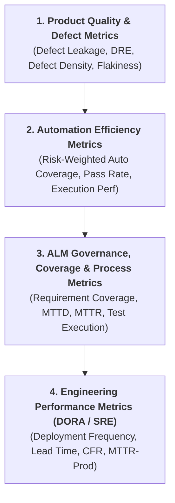
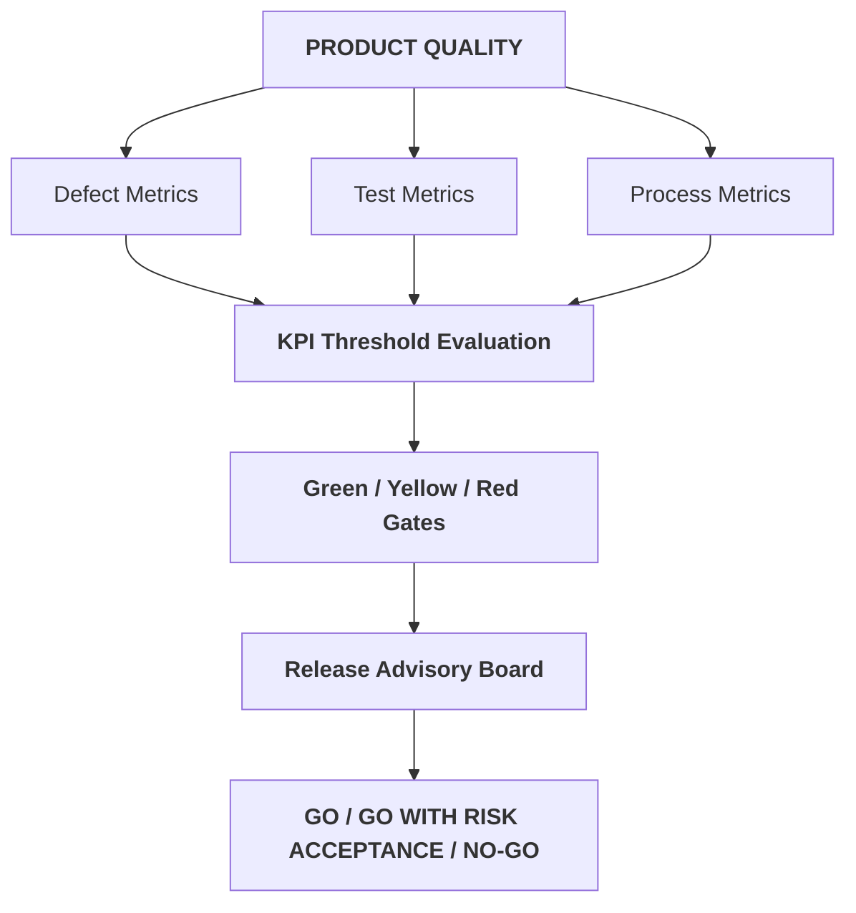
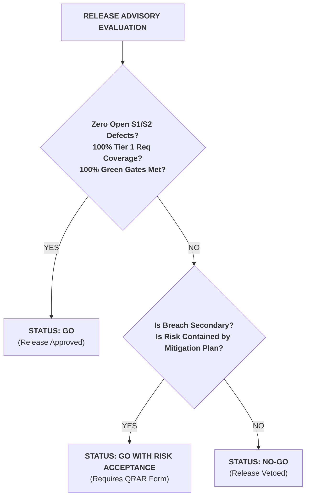

# Chapter 10: Software Quality Metrics, QA KPIs & Go/No-Go Criteria (QA Metrics, KPIs & Delivery Quality Governance)

## 10.1 Normative Principles of Quality Measurement and Governance

The measurement of software quality within the development lifecycle **MUST** be based on deterministic quantitative data and not on subjective status assessments. Every key performance indicator (KPI) or operationally implemented metric **MUST** comply with the following normative rules:

- **Mathematical Objectivity:** Every metric **MUST** possess an unambiguous mathematical formula, an explicit unit of measurement, and an automated collection procedure from CI/CD tools, ALM systems, or test execution engines.
    
- **Value Orientation and Engineering Decisions:** A metric **MUST NOT** be implemented solely as a vanity indicator (e.g., total number of executions or gross number of closed bugs). Every metric **MUST** be oriented towards supporting engineering decisions, evaluating software resilience, or enabling release Quality Gates.
    
- **Integration into Observability Pipelines:** Calculation engines and indicators **MUST** directly feed deployment gates in continuous integration and delivery (CI/CD) environments, correlating production telemetry with pre-deployment validations.
    

## 10.2 Quality Engineering Metrics Taxonomy and Classification

Test governance categorizes quality engineering indicators into four functional levels of observability:

### 10.2.1 Leading vs. Lagging Indicators

- **Leading Indicators:** Operational metrics that allow anticipating risks and preventing failures before release (e.g., _Flakiness Index_, _Tier 1 Requirement Coverage_, _Risk-Weighted Automation Coverage_).
    
- **Lagging Indicators:** Outcome metrics that measure the actual impact of quality after the process execution or software delivery to users (e.g., _Defect Leakage Rate_, _Defect Removal Efficiency_, _Change Failure Rate_).
    

## 10.3 Product Quality and Defect Management Metrics

### 10.3.1 Defect Leakage Rate

- **Definition:** Percentage of confirmed defects identified by end users, clients, or telemetry in production environments compared to the total defects detected during the entire release lifecycle.
    
- **Formula:**
    
    $$\text{Defect Leakage Rate (\%)} = \left( \frac{D_{\text{prod}}}{D_{\text{pre-prod}} + D_{\text{prod}}} \right) \times 100$$
    
    Where:
    
    - $D_{\text{prod}}$: Defects reported and confirmed in Production.
        
    - $D_{\text{pre-prod}}$: Defects detected in previous environments (QA, Staging, UAT).
        
- **Measurement Objective:** Evaluate the effectiveness of the pre-deployment test harness and measure the failure escape rate into production.
    
- **Interpretation:** An increase in the leakage rate indicates gaps in regression suites, unrealistic test data, or misalignment between testing and actual system usage (see **Chapter 03: Bug Report Engineering Standard & Governance**).
    

### 10.3.2 Defect Removal Efficiency (DRE)

- **Definition:** Quantitative metric that measures the engineering team's ability to identify and resolve failures before the official code release to production.
    
- **Formula:**
    
    $$\text{DRE (\%)} = \left( \frac{D_{\text{pre-prod}}}{D_{\text{pre-prod}} + D_{\text{prod}}} \right) \times 100$$
    
- **Measurement Objective:** Quantify the maturity of the early verification and inspection process within the organization.
    
- **Interpretation:** A $\text{DRE} \ge 95\%$ indicator reflects effective quality gates in early development stages (_Shift Left_).
    

### 10.3.3 Defect Density

- **Definition:** Proportion of confirmed defects relative to the size of the evaluated component, measured using a single consistent sizing unit defined by the organization (e.g., thousands of lines of source code [KLOC] or Function Points [FP]).
    
- **Formula:**
    
    $$\text{Defect Density} = \frac{\text{Total Confirmed Defects}}{\text{Consistent Sizing Unit (KLOC or FP)}}$$
    
- **Measurement Objective:** Identify failure-prone modules or microservices requiring architectural refactoring or an increase in automation coverage.
    
- **Interpretation:** Components with a defect density significantly higher than the system average **MUST** undergo exhaustive code reviews and design audits. _Note: Heterogeneous units (e.g., KLOC with Story Points) should not be mixed within the same historical series._
    

### 10.3.4 Flakiness Index

- **Definition:** Percentage of executions of an automated scenario that produce inconsistent results (pass/fail) on the same source code commit without environment changes.
    
- **Formula:**
    
    $$\text{Flakiness Index (\%)} = \left( \frac{E_{\text{inconsistent}}}{E_{\text{total}}} \right) \times 100$$
    
    Where:
    
    - $E_{\text{inconsistent}}$: Number of executions where the status varies between PASS and FAIL upon immediate retries without codebase changes.
        
    - $E_{\text{total}}$: Total number of scenario executions in the analyzed period.
        
- **Measurement Objective:** Quantify the reliability of the automation suite (see **Chapter 09: Test Automation Architecture**).
    
- **Interpretation:** A $\text{Flakiness Index} > 2\%$ demands immediate technical refactoring of the test case (locators, synchronization, or fixtures). Instability may stem from the test or from infrastructure/data fluctuations. Scenarios with a $\text{Flakiness Index} > 5\%$ **MUST** be tagged as `@flaky` and excluded from blocking CI/CD executions.
    

## 10.4 Test Automation and Execution Efficiency Metrics

### 10.4.1 Risk-Weighted Automation Coverage

- **Definition:** Percentage of executable test cases belonging to the regression suite that are automated, segmented explicitly by the feature's risk level (see **Chapter 01: Quality Engineering Strategy & Delivery Risk Model**).
    
- **Formula:**
    
    $$\text{Risk-Weighted Automation Coverage (Tier } n\text{) (\%)} = \left( \frac{TC_{\text{auto\_Tier\_}n}}{TC_{\text{total\_regression\_Tier\_}n}} \right) \times 100$$
    
- **Measurement Objective:** Prevent the distortion of the generic coverage indicator by prioritizing critical flows over low-risk scenarios.
    
- **Interpretation:** The corporate objective imposes a $\text{Risk-Weighted Automation Coverage (Tier 1)} = 100\%$, admitting lower thresholds in lower business impact scenarios (Tier 2 $\ge 80\%$, Tier 3 $\ge 40\%$).
    

### 10.4.2 Test Automation Pass Rate

- **Definition:** Proportion of automated test cases that finish in a successful state (_PASS_) during a suite execution in the CI/CD pipeline.
    
- **Formula:**
    
    $$\text{Test Automation Pass Rate (\%)} = \left( \frac{TC_{\text{passed}}}{TC_{\text{executed}}} \right) \times 100$$
    
- **Measurement Objective:** Validate the functional stability of integrated software in main code branches. _Note: This metric evaluates the percentage of successful assertions of the executed test suite, differentiating itself from the Pipeline Build Pass Rate._
    
- **Interpretation:** An indicator below the established project threshold interrupts the code promotion gate (_Build Pipeline Gate_).
    

## 10.5 Requirement Coverage, ALM Governance and Operation Metrics

### 10.5.1 Requirements Test Coverage

- **Definition:** Verified degree of linkage between approved business requirements or User Stories and the test cases (manual or automated) designed for their validation.
    
- **Formula:**
    
    $$\text{Requirement Coverage (\%)} = \left( \frac{R_{\text{covered}}}{R_{\text{total}}} \right) \times 100$$
    
    Where:
    
    - $R_{\text{covered}}$: Requirements with at least one associated test case in _Approved_ status in Jira/Xray (see **Chapter 08: Jira & Xray Integration for QA Governance & Traceability**).
        
    - $R_{\text{total}}$: Planned requirements for the Sprint or Release scope.
        
- **Measurement Objective:** Guarantee full traceability and prevent the release of unverified requirements.
    
- **Interpretation:** Every requirement classified as _Tier 1 Critical_ **MUST** have $100\%$ associated test coverage before authorizing its final development.
    

### 10.5.2 Mean Time to Detect (MTTD) & Mean Time to Resolve (MTTR)

- **MTTD (Mean Time to Detect):** Elapsed time from the first observable event or defective code deployment in an environment to the identification and entry of the report into the ALM system.
    
- **MTTR (Mean Time to Resolve):** Elapsed time from defect assignment (_Assigned_) to its correction, successful QA verification, and formal closure (_Closed_).
    
- **Formulas:**
    
    $$\text{MTTD} = \frac{\sum \left( T_{\text{detection}} - T_{\text{deployment/event}} \right)}{\text{Total Detected Defects}}$$
    
    $$\text{MTTR} = \frac{\sum \left( T_{\text{closure}} - T_{\text{assignment}} \right)}{\text{Total Resolved Defects}}$$

- **Measurement Objective:** Evaluate monitoring efficiency, triage speed, and software engineering responsiveness.
    

## 10.6 Integration with Engineering Performance Metrics (DORA & Observability)

Test governance integrates software quality indicators with the DORA (_DevOps Research and Assessment_) engineering performance framework and production observability telemetry (see **Chapter 04: Mobile Testing Strategy & Engineering Standard** and **Chapter 06: AI Systems, RAG Evaluation & Agentic Testing Standard**):

- **Change Failure Rate (CFR):** Percentage of production deployments causing a critical failure, service degradation, or requiring immediate intervention (hotfix/rollback).
    
    $$\text{CFR (\%)} = \left( \frac{\text{Failed Prod Deployments}}{\text{Total Prod Deployments}} \right) \times 100$$
    
- **Mean Time to Restore (MTTR-Prod):** Mean time required to restore service in production following a failure caused by a release.
    
- **Note on the Full DORA Suite:** Flow performance metrics _Deployment Frequency_ (DF) and _Lead Time for Changes_ (LTC) are part of overall engineering performance; although primarily managed by DevOps and Delivery Engineering, Quality Engineering actively participates in their interpretation to balance delivery speed with operational risk.
    
- **Observability Correlation:** _Defect Leakage_, _MTTD_, and _CFR_ metrics feed infrastructure observability dashboards (Datadog, New Relic, Dynatrace) to connect pre-deployment errors with operational traces (_APM Trace IDs_) and real-time logs.
    

## 10.7 Integrated KPI Matrix and Operational Thresholds (Quality Release Gates)

The following matrix establishes corporate metrics, their business objectives, and normative thresholds classified into three governance levels (_Green Gate_, _Yellow Gate_, _Red Gate_):

| **Metric Category** | **KPI Name** | **Calculation Formula** | **Business Objective** | **Green Gate (Approved)** | **Yellow Gate (Accepted Risk)** | **Red Gate (Blocked)** |
|---|---|---|---|---|---|---|
| **Product Quality** | Defect Leakage Rate | $\left( \frac{D_{\text{prod}}}{D_{\text{total}}} \right) \times 100$ | Minimize failure escape to production | $\le 2.0\%$ | $2.1\% - 5.0\%$ | $> 5.0\%$ |
| **Product Quality** | Defect Removal Efficiency | $\left( \frac{D_{\text{pre-prod}}}{D_{\text{total}}} \right) \times 100$ | Maximize early bug containment | $\ge 95.0\%$ | $90.0\% - 94.9\%$ | $< 90.0\%$ |
| **Automation** | Test Automation Pass Rate | $\left( \frac{TC_{\text{passed}}}{TC_{\text{executed}}} \right) \times 100$ | Ensure functional CI stability | $\ge 98.0\%$ | $95.0\% - 97.9\%$ | $< 95.0\%$ |
| **Automation** | Risk-Weighted Auto (Tier 1) | $\left( \frac{TC_{\text{auto\_T1}}}{TC_{\text{total\_T1}}} \right) \times 100$ | Automate 100% of the critical core | $100\%$ | $90.0\% - 99.9\%$ | $< 90.0\%$ |
| **Suite Resilience** | Flakiness Index | $\left( \frac{E_{\text{inconsistent}}}{E_{\text{total}}} \right) \times 100$ | Maintain test confidence | $\le 1.0\%$ | $1.1\% - 2.0\%$ | $> 2.0\%$ |
| **ALM Governance** | Requirement Coverage (Tier 1) | $\left( \frac{R_{\text{covered}}}{R_{\text{total}}} \right) \times 100$ | Ensure total business traceability | $100\%$ | N/A | $< 100\%$ |
| **Engineering / DORA** | Change Failure Rate (CFR) | $\left( \frac{\text{Failures}}{\text{Deployments}} \right) \times 100$ | Reduce release operational impact | $\le 5.0\%$ | $5.1\% - 10.0\%$ | $> 10.0\%$ |
| **Operational Efficiency** | MTTR (S1/S2 Defects) | $\frac{\sum \text{Resolution Time}}{\text{Resolved S1/S2 Defects}}$ | Accelerate blocker mitigation | $\le 4 \text{ hours}$ | $4.1 - 24.0 \text{ hours}$ | $> 24.0 \text{ hours}$ |

## 10.8 KPI-Based Corrective Action Matrix

When a metric or KPI falls outside operational tolerances, Quality Engineering governance mandates the execution of the following immediate corrective actions:

| **Deviating Metric** | **Symptom or Technical Origin Detected** | **Required Engineering Corrective Action** |
|---|---|---|
| **Defect Leakage Rate $\uparrow$ ($> 5\%$)** | Test suites misaligned with actual usage patterns; outdated test data. | Audit Tier 1 scenario coverage; update synthetic/masked datasets and execute focused _Exploratory Testing_ sessions. |
| **Flakiness Index $\uparrow$ ($> 2\%$)** | Interface asynchrony, fragile locators, or lack of data/infrastructure isolation. | Isolate unstable scripts in quarantine (`@flaky`); refactor semantic locators and conditional synchronizations (see **Chapter 09: Test Automation Architecture**). |
| **Defect Removal Efficiency $\downarrow$ ($< 90\%$)** | Ambiguous acceptance criteria; late validation during Sprint lifecycle. | Implement _Three Amigos_ dynamics; advance contract testing in APIs and intensify _Shift Left_ practices (see **Chapter 01: Quality Engineering Strategy & Delivery Risk Model**). |
| **MTTR of S1/S2 Defects $\uparrow$ ($> 24\text{h}$)** | Insufficient technical evidence in tickets; bottlenecks in triage process. | Make automated log/trace collection mandatory (see **Chapter 03: Bug Report Engineering Standard & Governance**); convene daily technical _War Rooms_ to unblock S1/S2 tickets. |
| **Change Failure Rate $\uparrow$ ($> 10\%$)** | Deployment gate failures; lack of configuration or migration validations. | Freeze new requirement promotion; execute _Quality Gates_ audits in CI/CD pipelines and reinforce persistence tests (see **Chapter 07: SQL & Data Integrity Testing Strategy**). |

## 10.9 Release Advisory Framework: GO / GO WITH RISK ACCEPTANCE / NO-GO

The Release Advisory Framework is the formal mechanism by which Quality Engineering leadership evaluates the totality of indicators to consolidate a release dictum to production.

---

### 10.9.1 Dictum Classification Criteria

1. **GO (Approved):** The release satisfies $100\%$ of _Green Gate_ thresholds, registers no open S1/S2 severity defects, and has $100\%$ successful executions in Tier 1 flows.
    
2. **GO WITH RISK ACCEPTANCE (Approved with Controlled Risk):** The release presents minor deviations or metrics within the _Yellow Gate_ threshold (e.g., a non-blocking S3 failure or a secondary automation indicator below target), provided there is a technical containment plan and a signed approval.
    
3. **NO-GO (Release Veto):** Any breach of a _Red Gate_ threshold, presence of unresolved open S1 or S2 defects, or lack of traceability in Tier 1 requirements imposes an immediate deployment veto.
    

### 10.9.2 Risk Acceptance Protocol

In exceptional business scenarios where a release must be executed under a _GO WITH RISK ACCEPTANCE_ state, authorization **MUST NOT** be granted verbally. The team **MUST** formalize the risk exception document in the ALM system including:

- Definition of the metric or criterion in breach status.
- Technical impact and _Blast Radius_ analysis.
- Operational containment plan (activation of _Feature Flags_, APM alerts, or automatic _Rollback_ procedures).
- Technical debt correction commitment within a maximum term of $\le 5 \text{ business days}$.
- Recorded digital approvals from the _QA Lead_, _Engineering Lead_, and _Product Owner_.
    

## 10.10 Reusable Blueprints

### 10.10.1 Template 01: Executive Quality Status Report and KPI Dashboard

- > **Central Template:** [View QE_QUALITY_STATUS_REPORT_TEMPLATE.md](../12-Templates/10-QA-Metrics-KPIs/QE_QUALITY_STATUS_REPORT_TEMPLATE.md)

### 10.10.2 Template 02: Quality Risk Acceptance Record Template

- > **Central Template:** [View RISK_ACCEPTANCE_RECORD_TEMPLATE.md](../12-Templates/10-QA-Metrics-KPIs/RISK_ACCEPTANCE_RECORD_TEMPLATE.md)

## References

- [01 - Test Strategy](../01-Test-Strategy/01 - Test Strategy.md) (Global strategy, quality gates, and deliverable risk model).
- [02 - Test Cases](../02-Test-Cases/02 - Test Cases.md) (Design methodology and test scenario traceability).
- [03 - Bug Reports](../03-Bug-Reports/03 - Bug Reports.md) (Severity/priority classification and defect lifecycle).
- [04 - Mobile Testing](../04-Mobile-Testing/04 - Mobile Testing.md) (Environment strategy and resilience testing in client apps).
- [05 - API Testing](../05-API-Testing/05 - API Testing.md) (Contract validation and unexpected failure metrics in APIs).
- [06 - AI Testing](../06-AI-Testing/06 - AI Testing.md) (Quality metrics, hallucination, and evaluation in intelligent systems).
- [07 - SQL for QA](../07-SQL-for-QA/07 - SQL for QA.md) (Persistence validation and data reconciliation metrics).
- [08 - Jira-Xray](../08-Jira-Xray/08 - Jira-Xray.md) (Requirements coverage setup and ALM sync).
- [09 - Test Automation](../09-Test-Automation/09 - Test Automation.md) (Design patterns, flow isolation, and Flaky Tests management).