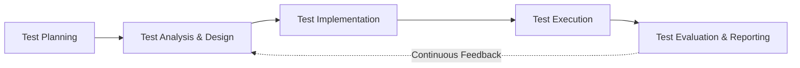
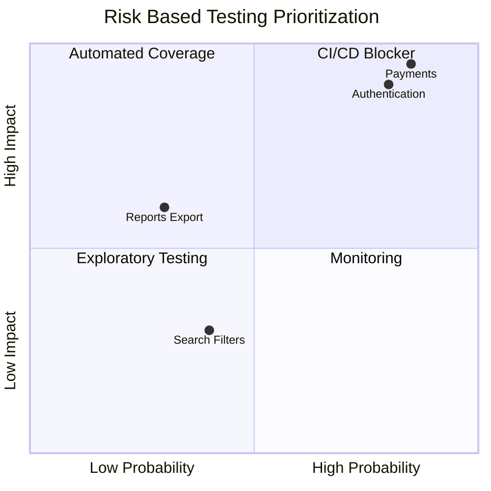

# Chapter 11: QA Process Alignment under ISTQB Standards in Agile Environments (Agile ISTQB Governance Standard)

## 11.1 Core ISTQB Quality Invariants

These principles act as mandatory quality invariants within the organization, regardless of the framework, tool, or work methodology used. Any implementation within the software development lifecycle **MUST** formally align with the seven fundamental testing principles defined by ISTQB (International Software Testing Qualifications Board), operationally adapted to iterative and incremental workflows (Agile/DevOps):

1. **Testing shows the presence of defects, not their absence:** Validation activities in CI/CD pipelines reduce the probability of undiscovered defects but do not constitute absolute proof of correctness.
    
2. **Exhaustive testing is impossible:** Test coverage **MUST** be prioritized based on risk analysis and business impact (see **Chapter 01: Quality Engineering Strategy & Delivery Risk Model**).
    
3. **Early testing saves time and money (Shift Left):** Quality activities **MUST** start in the requirement refinement phase using static user story analysis and BDD/TDD techniques.
    
4. **Defect clustering:** Regression suite design **MUST** focus the automation density on components that historically concentrate the highest defect rate (Pareto Rule).
    
5. **Pesticide paradox:** Automated test suites **MUST** be refactored and periodically updated to prevent effectiveness loss against constantly evolving code.
    
6. **Testing is context dependent:** Testing strategies **MUST** adapt to the nature of the domain (mobile, API, databases, or AI systems).
    
7. **Absence-of-errors is a fallacy:** The absence of technical defects does not guarantee that the system satisfies business objectives or the expected end-user value.
    

## 11.2 Agile Testing Governance Principles

Test governance in agile environments **MUST** be based on shared quality responsibility and deterministic continuous delivery criteria:

- **Whole Team Responsibility:** Quality is the responsibility of the cross-functional team. The QA Engineering role acts as a governance facilitator, test architecture designer, and quality framework guarantor.
    
- **Definition of Done (DoD) Quality Criteria:** A user story **MUST NOT** be considered completed without meeting the minimum quality criteria:
    
    - 100% of acceptance criteria validated through automated, manual, or exploratory tests according to the risk profile.
        
    - Regression tests executed without introducing pipeline failures.
        
    - Security risk assessment and impact analysis completed (see **Chapter 03: Bug Report Engineering Standard & Governance**).
        
- **Continuous Testing in CI/CD:** Quality validation does not constitute a post-development phase, but rather an activity continuously integrated into each commit and Pull Request.
    

## 11.3 Testing Levels & CI/CD Mapping

The testing levels and types defined by the ISTQB standard **MUST** be deterministically integrated within the continuous delivery pipeline through the following engineering mapping:

### 11.3.1 Operational Mapping Matrix

| **ISTQB Level** | **ISTQB Test Type** | **Artifact / Technique** | **CI/CD Integration Point** | **Associated Quality Gate (Risk-Based)** |
|---|---|---|---|---|
| **Component Testing** | Structural / Functional | Unit Tests, Mocks, Stubs | _Pre-commit / Pull Request_ | Coverage per risk profile (Critical Components: $\ge 80\%$ Branch Coverage) |
| **Component Integration** | Functional / Interface | Service Mocks, Module Integration | _Build Pipeline (Development)_ | Zero integration errors between modules |
| **System Integration Testing** | Interface / Data / Contract | API Contract Tests (Pact), Event Validation | _Build Pipeline (Staging)_ | Zero API/Event contract violations (see **Chapter 05: API Testing Strategy & Engineering Standard**) |
| **System Testing** | Functional / Non-Functional | End-to-End (E2E) Suites, Performance Baseline | _Nightly Build / Staging_ | $100\%$ successful execution on Critical User Journeys |
| **Acceptance Testing** | Functional / Usability | User Acceptance Testing (UAT), BDD Features | _Pre-Release / Canary_ | 100% Validated Acceptance Criteria |

## 11.4 Agile Test Process Adaptation

The ISTQB fundamental test process **MUST** be executed continuously, in parallel, and interactively during each iteration or Sprint:

- **Test Planning:** Alignment of the strategy with the Sprint Goal, risk model definition, and test resource calibration.
    
- **Test Analysis & Design:** Derivation of test scenarios from Acceptance Criteria during User Story refinement sessions (see **Chapter 02: Test Case Design Methodology & Engineering Standard**).
    
- **Test Implementation:** Construction of fixtures, preparation of synthetic/masked data, and coding of automation scripts.
    
- **Test Execution:** Automated execution in the CI/CD pipeline and focused exploratory validation.
    
- **Test Evaluation & Reporting:** Evaluation of Exit Criteria, regression performance analysis, and direct feedback into Backlog refinement (see **Chapter 10: QA Metrics & KPIs**).
    

## 11.5 Test Design Techniques Applied to Automation

Test case design **MUST** be based on formal test design techniques, selected according to the test level, system characteristics, and risk profile, to maximize effective coverage without generating operational redundancy.

### 11.5.1 Equivalence Partitioning (EP) and Boundary Value Analysis (BVA)

Applied to the validation of input fields and API parameters (see **Chapter 05: API Testing Strategy & Engineering Standard**):

$$\text{Boundary Values} = \{x_{\text{min}-1}, x_{\text{min}}, x_{\text{min}+1}, x_{\text{nom}}, x_{\text{max}-1}, x_{\text{max}}, x_{\text{max}+1}\}$$

- **Normative Requirement:** Any numerical or string length parameter with explicit constraints **MUST** be tested in valid/invalid partitions and at the boundary values adjacent to the input frontiers.
    

### 11.5.2 Decision Table Testing

Complex business rules with multiple boolean conditions **MUST** be formalized using decision tables prior to their coding in automated test scripts.

| **Conditions / Actions** | **Rule 1** | **Rule 2** | **Rule 3** | **Rule 4** |
|---|---|---|---|---|
| **User Authenticated** | True | True | False | False |
| **Sufficient Balance** | True | False | True | False |
| **Action: Authorize Transaction** | **X** | - | - | - |
| **Action: Reject for Balance** | - | **X** | - | - |
| **Action: Redirect to Login** | - | - | **X** | **X** |

### 11.5.3 State Transition Testing

Systems with explicit entity lifecycles (e.g., transactions, orders, tickets) **MUST** validate all allowed transitions and attempt to execute invalid transitions to verify exception handling robustness.

### 11.5.4 Pairwise Testing (Combinatorial Testing)

Applied to independent multivariable configurations (devices, browsers, operating systems, or API parameter matrices) where exhaustive combinatorial testing is unfeasible:

- **Normative Requirement:** When a component requires the evaluation of multiple discrete variables where exhaustive combinatorial testing is unfeasible, Pairwise Testing **MUST** be considered as a controlled combination reduction technique to guarantee that all possible pairs of parameters are tested at least once, maximizing coverage efficiency.
    

## 11.6 Product & Project Risk Governance

The prioritization of automation and manual execution efforts **MUST** be based on a quantitative product risk assessment model:

$$\text{Risk Score} = \text{Impact (1-5)} \times \text{Likelihood (1-5)}$$

The resulting scores are placed on an operational scale from $1$ to $25$. For visual representation purposes in analysis tools, values are normalized into a range from $0.0$ to $1.0$.

The matrix represents the relationship between the probability of occurrence and risk impact. Components located in the top-right quadrant represent critical assets requiring maximum automation priority and continuous validation within the CI/CD pipeline. Elements with lower impact or probability can be managed through proportional strategies such as exploratory testing, monitoring, or selective automated coverage.

## 11.7 Reusable Blueprints

### 11.7.1 Template 01: ISTQB Agile Traceability & Test Design Record

- **Objective:** Ensure bidirectional traceability between the business rule, the design technique used, the ISTQB test level, and the automated executable.

> **Central Template:** [View ISTQB_AGILE_TRACEABILITY_MATRIX.md](12-Templates/11-Agile-ISTQB-Governance/ISTQB_AGILE_TRACEABILITY_MATRIX.md)

## References

- [01 - Test Strategy](01%20-%20Test%20Strategy.md) (Entry and exit criteria, quality gates, and overall risk model).
- [02 - Test Cases](02%20-%20Test%20Cases.md) (Formal standards for test scenario design).
- [03 - Bug Reports](03%20-%20Bug%20Reports.md) (Severity/priority classification and defect lifecycle).
- [05 - API Testing](05%20-%20API%20Testing.md) (Integration testing at the contract and interface level).
- [08 - Jira-Xray](08%20-%20Jira-Xray.md) (Bidirectional requirement traceability and software lifecycle synchronization).
- [10 - QA Metrics - KPIs](10%20-%20QA%20Metrics%20-%20KPIs.md) (Defect Removal Efficiency (DRE) indicators and production leakage rates).
