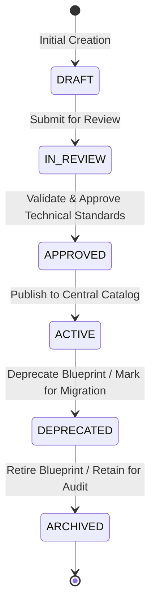
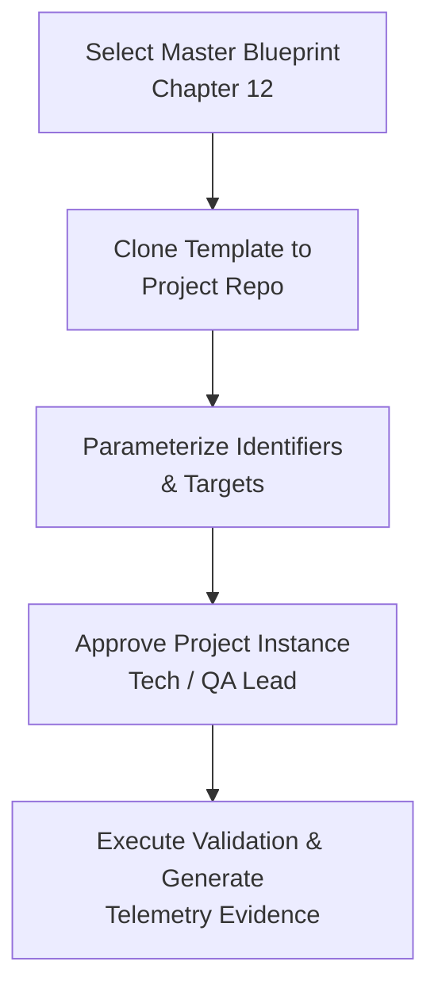

# Chapter 12: Central Library of Quality Engineering Templates and Reusable Artifacts (Quality Engineering Templates & Artifacts Blueprint Library)

## 12.1 Quality Artifacts Management Standard and Governance

The centralization of artifacts, templates, and documentary structures within the QA Handbook guarantees operational consistency, process interoperability, and technical standardization across all software engineering teams in the organization.

Every artifact or template deployed in the project infrastructure **MUST** formally align with the following normative governance principles:

- **Invariance and Parameterization:** Templates **MUST NOT** contain specific project values, client names, or explicit credentials. Every dynamic field **MUST** be represented using standardized placeholders (e.g., `<REQUIREMENT_ID>`, `<ENVIRONMENT_NAME>`, `<API_ENDPOINT>`).
    
- **Sensitive Data Sanitization (PII Sanitization):** No template or explanatory example **MUST** include personally identifiable information (PII), functional JWT tokens, API keys, or infrastructure secrets. Test data in artifacts **MUST** be purely synthetic or anonymized, complying with the directives of **Chapter 01: Quality Engineering Strategy & Delivery Risk Model** and **Chapter 07: SQL & Data Integrity Testing Strategy**.
    
- **Instantiation Operational Model:** The templates exposed in this repository operate under a conceptual model of three abstraction layers:
    
    $$\text{Master Blueprint (Ch. 12)} \longrightarrow \text{Project Instance} \longrightarrow \text{Execution Artifact}$$
    
    The Master Blueprints represent the controlled and versioned corporate baseline; Project Instances adapt the parameterization to the technical context of the target repository; and Execution Artifacts constitute the executable evidence recorded in the project telemetry.
    
- **Maintainability and Version Control:** Documentary templates **MUST** be maintained under deterministic version control in this central repository. Any structural modification on a blueprint requires formal approval from the QA Governance team.
    

## 12.2 Central Artifact Repository Architecture

The directory distribution within the general QA Handbook structure organizes the master blueprints centrally under the `12-Templates/` directory, segregated by technical domain. Chapters 01 to 11 contain the theoretical and normative foundation, while `12-Templates/` acts as the single source of truth for operational deployment in projects:

```
QA-Handbook/
├── 01-Test-Strategy/                 # Theoretical foundation and risk models
├── 02-Test-Cases/                    # Design methodology and ISTQB techniques
├── 03-Bug-Reports/                   # Taxonomy standards and failure lifecycle
├── 04-Mobile-Testing/                # Resilience strategy and client testing
├── 05-API-Testing/                   # Contract strategies and HTTP security
├── 06-AI-Testing/                    # RAG methodology, agent evaluation, and guardrails
├── 07-SQL-for-QA/                    # ACID principles, persistence, and reconciliation
├── 08-Jira-Xray/                     # ALM governance and traceability schemas
├── 09-Test-Automation/               # Code patterns (POM, Fixtures) and pipelines
├── 10-QA-Metrics-KPIs/               # Metrics governance and Release Advisory
├── 11-Agile-ISTQB-Governance/        # Alignment with international standards
└── 12-Templates/                     # CENTRAL ARTIFACT AND TEMPLATE LIBRARY
    ├── 01-Test-Strategy/             # Strategy Blueprints and Risk Registers
    ├── 02-Test-Cases/                # Charters and Exploratory Testing Blueprints
    ├── 03-Bug-Reports/               # Report and Incident Blueprints
    ├── 04-Mobile-Testing/            # Resilience Testing Blueprints
    ├── 05-API-Testing/               # API Contract and Security Blueprints
    ├── 06-AI-Testing/                # RAG Evaluation and Golden Datasets Blueprints
    ├── 07-SQL-for-QA/                # Data Management and Cleanup Blueprints
    ├── 08-Jira-Xray/                 # ALM Control and Sync Workflows
    ├── 09-Test-Automation/           # Automation Framework Blueprints
    ├── 10-QA-Metrics-KPIs/           # Quality Status and Risk Acceptance Blueprints
    └── 11-Agile-ISTQB-Governance/    # Traceability Matrices
```

## 12.3 Central Template Catalog and Lifecycle Governance (Master Artifact Index)

### 12.3.1 Master Artifact Index Matrix

The following matrix classifies the documentary artifacts available in the central library, detailing their physical location, governance owner, active version, last revision date, and the normative source chapter:

| **Artifact Identifier** | **Engineering Domain** | **Central File Location** | **Owner** | **Version** | **Status** | **Last Revision** | **Normative Source Chapter** |
|---|---|---|---|---|---|---|---|
| **BLUEPRINT-STRAT-01** | Strategy & Risk | 12-Templates/01-Test-Strategy/FEATURE_TEST_STRATEGY_TEMPLATE.md | QA Lead | 1.0.0 | APPROVED | 2026-07-31 | **Chapter 01: Quality Engineering Strategy** |
| **BLUEPRINT-TC-01** | Test Design & Exec | 12-Templates/02-Test-Cases/EXPLORATORY_TESTING_CHARTER.md | QA Engineer | 1.0.0 | APPROVED | 2026-07-31 | **Chapter 02: Test Case Design Methodology** |
| **BLUEPRINT-TC-02** | Test Design & Exec | 12-Templates/02-Test-Cases/TC_IAM_PII_COMP_REUSABLE.md | QA Engineer | 1.0.0 | APPROVED | 2026-07-31 | **Chapter 02: Test Case Design Methodology** |
| **BLUEPRINT-TC-03** | Test Design & Exec | 12-Templates/02-Test-Cases/TC_PAY_CHECKOUT_FUNC_REUSABLE.md | QA Engineer | 1.0.0 | APPROVED | 2026-07-31 | **Chapter 02: Test Case Design Methodology** |
| **BLUEPRINT-BUG-01** | Incident Governance | 12-Templates/03-Bug-Reports/BUG_REPORT_TEMPLATE.md | QA Governance | 1.0.0 | APPROVED | 2026-07-31 | **Chapter 03: Bug Report Engineering Standard** |
| **BLUEPRINT-MOB-01** | Mobile QA | 12-Templates/04-Mobile-Testing/ADR-001-HYBRID_MOBILE.md | Mobile QA Lead | 1.0.0 | APPROVED | 2026-07-31 | **Chapter 04: Mobile App Testing Strategy** |
| **BLUEPRINT-MOB-02** | Mobile QA | 12-Templates/04-Mobile-Testing/TC_MOB_RESILIENCE_REUSABLE.md | Mobile QA Lead | 1.0.0 | APPROVED | 2026-07-31 | **Chapter 04: Mobile App Testing Strategy** |
| **BLUEPRINT-API-01** | API & Integration | 12-Templates/05-API-Testing/TC_API_BOLA_SECURITY_REUSABLE.md | Backend QA Engineer | 1.0.0 | APPROVED | 2026-07-31 | **Chapter 05: API Testing Strategy** |
| **BLUEPRINT-AI-01** | AI Governance | 12-Templates/06-AI-Testing/AI_SYSTEM_EVALUATION_REPORT.md | AI QA Specialist | 1.0.0 | APPROVED | 2026-07-31 | **Chapter 06: AI Systems & RAG Evaluation** |
| **BLUEPRINT-AI-02** | AI Governance | 12-Templates/06-AI-Testing/CUSTOMER_SUPPORT_GDPR_TEMPLATE.md | AI QA Specialist | 1.0.0 | APPROVED | 2026-07-31 | **Chapter 06: AI Systems & RAG Evaluation** |
| **BLUEPRINT-AI-03** | AI Governance | 12-Templates/06-AI-Testing/GOLDEN_DATASET_ENTRY_TEMPLATE.md | AI QA Specialist | 1.0.0 | APPROVED | 2026-07-31 | **Chapter 06: AI Systems & RAG Evaluation** |
| **BLUEPRINT-AI-04** | AI Governance | 12-Templates/06-AI-Testing/TC_AI_RAG_SAFETY_EVAL_REUSABLE.md | AI QA Specialist | 1.0.0 | APPROVED | 2026-07-31 | **Chapter 06: AI Systems & RAG Evaluation** |
| **BLUEPRINT-DATA-01** | Data Governance | 12-Templates/07-SQL-for-QA/TC_SQL_INTEGRITY_REUSABLE.md | Data QA Lead | 1.0.0 | APPROVED | 2026-07-31 | **Chapter 07: SQL & Data Integrity Testing** |
| **BLUEPRINT-DATA-02** | Data Governance | 12-Templates/07-SQL-for-QA/TEST_DATA_MANAGEMENT_PLAN.md | Data QA Lead | 1.0.0 | APPROVED | 2026-07-31 | **Chapter 07: SQL & Data Integrity Testing** |
| **BLUEPRINT-ALM-01** | ALM Tooling | 12-Templates/08-Jira-Xray/XRAY_JUNIT_IMPORT.md | QA Governance | 1.0.0 | APPROVED | 2026-07-31 | **Chapter 08: Jira & Xray Integration** |
| **BLUEPRINT-ALM-02** | ALM Tooling | 12-Templates/08-Jira-Xray/XRAY_SYNC_WORKFLOW.md | QA Governance | 1.0.0 | APPROVED | 2026-07-31 | **Chapter 08: Jira & Xray Integration** |
| **BLUEPRINT-AUTO-01** | Test Automation | 12-Templates/09-Test-Automation/PLAYWRIGHT_WEB_ARCHITECTURE.md | SDET Lead | 1.0.0 | APPROVED | 2026-07-31 | **Chapter 09: Test Automation Architecture** |
| **BLUEPRINT-AUTO-02** | Test Automation | 12-Templates/09-Test-Automation/TEST_AUTOMATION_CI_PIPELINE.md | SDET Lead | 1.0.0 | APPROVED | 2026-07-31 | **Chapter 09: Test Automation Architecture** |
| **BLUEPRINT-METRIC-01** | Quality Advisory | 12-Templates/10-QA-Metrics-KPIs/QE_QUALITY_STATUS_REPORT_TEMPLATE.md | QE Manager | 1.0.0 | APPROVED | 2026-07-31 | **Chapter 10: QA Metrics & KPIs** |
| **BLUEPRINT-METRIC-02** | Quality Advisory | 12-Templates/10-QA-Metrics-KPIs/RISK_ACCEPTANCE_RECORD_TEMPLATE.md | QE Manager | 1.0.0 | APPROVED | 2026-07-31 | **Chapter 10: QA Metrics & KPIs** |
| **BLUEPRINT-GOV-01** | Agile Traceability | 12-Templates/11-Agile-ISTQB-Governance/ISTQB_AGILE_TRACEABILITY_MATRIX.md | QA Governance | 1.0.0 | APPROVED | 2026-07-31 | **Chapter 11: Agile ISTQB Governance** |

### 12.3.2 Quality Artifacts Lifecycle Governance

Every test artifact **MUST** transition through a deterministic state machine to ensure that only approved and current templates are deployed in production pipelines:



- **DRAFT:** Artifact in initial proposal or modification. **MUST NOT** be used in official projects.
    
- **IN_REVIEW:** Technical evaluation by the QA Governance team and Tech Leads.
    
- **APPROVED:** Artifact technically validated and verified for compliance.
    
- **ACTIVE:** Officially published in the central catalog and authorized for direct deployment in projects.
    
- **DEPRECATED:** Artifact in the process of replacement. **MUST NOT** be used in new projects; existing projects **SHOULD** migrate within a timeframe shorter than 30 days.
    
- **ARCHIVED:** Decommissioned artifact retained solely for historical audit purposes.
    

## 12.4 Artifact Consumption Workflow

To guarantee the consistent instantiation of master artifacts in engineering projects, teams **MUST** follow the subsequent operational sequence:



## 12.5 Master Templates for Project Deployment

### 12.5.1 Universal Feature Test Strategy & Decision Blueprint

> **Central Template:** [View FEATURE_TEST_STRATEGY_TEMPLATE.md](01-Test-Strategy/FEATURE_TEST_STRATEGY_TEMPLATE.md)

### 12.5.2 Universal Defect Report & Impact Assessment Blueprint

> **Central Template:** [View BUG_REPORT_TEMPLATE.md](03-Bug-Reports/BUG_REPORT_TEMPLATE.md)

### 12.5.3 Universal Quality Status Report & Release Advisory Blueprint

> **Central Template:** [View QE_QUALITY_STATUS_REPORT_TEMPLATE.md](10-QA-Metrics-KPIs/QE_QUALITY_STATUS_REPORT_TEMPLATE.md)

### 12.5.4 Test Data Management Plan Blueprint

> **Central Template:** [View TEST_DATA_MANAGEMENT_PLAN.md](07-SQL-for-QA/TEST_DATA_MANAGEMENT_PLAN.md)

### 12.5.5 Exploratory Testing Charter Blueprint

> **Central Template:** [View EXPLORATORY_TESTING_CHARTER.md](02-Test-Cases/EXPLORATORY_TESTING_CHARTER.md)

### 12.5.6 AI System Evaluation Report Blueprint

> **Central Template:** [View AI_SYSTEM_EVALUATION_REPORT.md](06-AI-Testing/AI_SYSTEM_EVALUATION_REPORT.md)

## References

- [01 - Test Strategy](01-Test-Strategy/01 - Test Strategy.md) (Definition of quality gates and risk prioritization).
- [02 - Test Cases](02-Test-Cases/02 - Test Cases.md) (Creation standard and traceability of test scenarios).
- [03 - Bug Reports](03-Bug-Reports/03 - Bug Reports.md) (Lifecycle, taxonomy, and severity matrix for failures).
- [06 - AI Testing](06-AI-Testing/06 - AI Testing.md) (Quality metrics, hallucinations, and evaluation in artificial intelligence systems).
- [07 - SQL for QA](07-SQL-for-QA/07 - SQL for QA.md) (Persistence validation and personal data masking).
- [08 - Jira-Xray](08-Jira-Xray/08 - Jira-Xray.md) (ALM entities setup and traceability).
- [09 - Test Automation](09-Test-Automation/09 - Test Automation.md) (Automation design patterns, POM, and fixtures).
- [10 - QA Metrics - KPIs](10-QA-Metrics-KPIs/10 - QA Metrics - KPIs.md) (Mathematical formulations, thresholds, and Release Advisory governance).
- [11 - Agile ISTQB Governance Standard](11-Agile-ISTQB-Governance/11 - Agile ISTQB Governance Standard.md) (Fundamental testing principles and agile traceability).