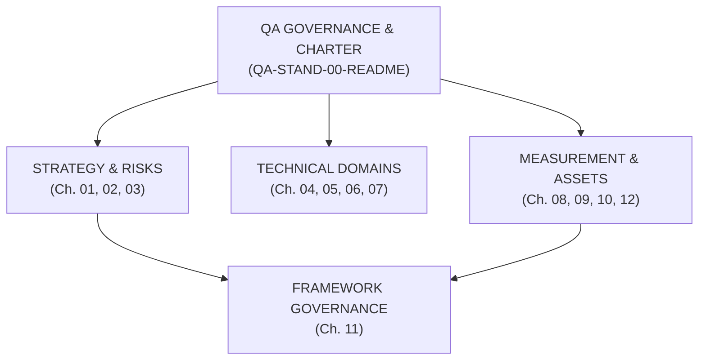
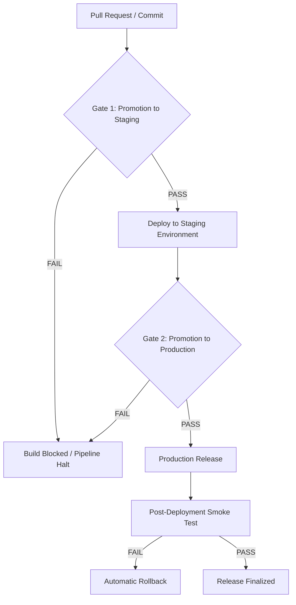

# QA Engineering Handbook Repository Index

## 1. Handbook Core Vision

The QA Engineering Handbook is the technical reference specification for institutional quality engineering models, designed to serve as a reusable operational and governance framework in modern software development teams.

This repository does not constitute an introductory tutorial, a training course, or a theoretical guide; it represents the operational model and core technical standard governing quality processes, automation architectures, data governance, API validation, AI/RAG system evaluation, observability, and risk management across the Software Development Life Cycle (SDLC).



### Core Engineering Principles

- **Rigorous Normative Language (RFC Specification Standard):** All quality requirements MUST be specified using imperative terminology compliant with RFC 2119 and RFC 8174 standards (MUST, MUST NOT, SHOULD, SHOULD NOT, MAY).
    
- **Invariance and Parameterization:** Definitions, strategies, and artifacts MUST be decoupled from specific organizations or proprietary implementations. They are structured using standardized placeholders (e.g., `<USER_ID>`, `<API_ENDPOINT>`, `<REQUIREMENT_ID>`).
    
- **Shift Left and Continuous Integration (CI/CD):** Quality validation MUST execute deterministically from early design phases via automated Quality Gates in CI/CD pipelines (e.g., GitHub Actions).
    
- **Modular and Decoupled Architecture:** Each chapter MUST represent an independent technical domain with defined boundary responsibilities, interconnected through explicit cross-references.
    

## 2. Repository Structure

The repository is formally organized into a modular structure of 12 technical reference domains and a centralized catalog of executable artifacts:

```
QA-Handbook/
├── 01-Test-Strategy/                     # Corporate quality strategy, risk model, and Quality Gates
├── 02-Test-Cases/                        # Scenario design methodology, atomicity, and invariants
├── 03-Bug-Reports/                       # Defect governance, severity vs priority matrix, and RCA
├── 04-Mobile-Testing/                    # Testing in mobile ecosystems (Android/iOS), network, and resilience
├── 05-API-Testing/                       # REST contract validation, RBAC, BOLA, and interface security
├── 06-AI-Testing/                        # AI evaluation, RAG architectures, hallucinations, and Guardrails
├── 07-SQL-for-QA/                        # Persistence validation, SQL referential integrity, and Data Masking
├── 08-Jira-Xray/                         # End-to-end ALM traceability, audit JQL, and story coverage
├── 09-Test-Automation/                   # Automation architecture (POM, Fixtures, Sharding, locators)
├── 10-QA-Metrics-KPIs/                   # Quantitative indicators, DRE, Defect Leakage, and Release Advisory
├── 11-Agile-ISTQB-Governance/            # Process alignment under ISTQB standards adapted for agile environments
└── 12-Templates/                         # Master catalog of documentation blueprints and technical instantiation
```

## 3. Master Chapter Index

|**Chapter ID**|**Chapter Title**|**Document Ref**|**Engineering Domain**|**Primary Responsibility**|
|---|---|---|---|---|
|**01-Test-Strategy**|Quality Engineering Strategy & Delivery Risk Model|QA-STAND-01-STRATEGY|Strategy & Delivery Risk|Weighted risk model, CI/CD quality gates, and Quality Guardrails.|
|**02-Test-Cases**|Test Case Design Methodology & Engineering Standard|QA-STAND-02-DESIGN|Test Governance|Design invariants (Atomicity, Repeatability), DoR, Entry/Exit criteria.|
|**03-Bug-Reports**|Bug Report Engineering Standard & Governance|QA-STAND-03-BUG-REPORTS|Incident Governance|Defect lifecycle, Severity/Priority matrix, RCA, and leakage analysis.|
|**04-Mobile-Testing**|Mobile Testing Strategy & Engineering Standard|QA-STAND-04-MOBILE|Mobile Systems|Android/iOS testing, network resilience, battery, and evidence collection.|
|**05-API-Testing**|API Testing Strategy & Engineering Standard|QA-STAND-05-API|API & Security Governance|Contract testing, RBAC/BOLA security, OpenAPI schemas, and TLS transport.|
|**06-AI-Testing**|AI Systems, RAG Evaluation & Agentic Testing Standard|QA-STAND-06-AI-TESTING|AI & RAG Observability|RAG metrics (Faithfulness, Relevance), hallucination evaluation, and Guardrails.|
|**07-SQL-for-QA**|SQL & Data Integrity Testing Strategy|QA-STAND-07-SQL|Database Governance|Referential integrity, ACID isolation, PII sanitization, and migration scripts.|
|**08-Jira-Xray**|Jira & Xray Integration for QA Governance|QA-STAND-08-JIRA-XRAY|ALM & Traceability|Entity mapping (Test, Execution, Plan), audit JQL, and traceability.|
|**09-Test-Automation**|Test Automation Architecture & Software Design|QA-STAND-09-AUTO-ARCH|Automation Architecture|Abstraction patterns (POM), isolation via Fixtures, and parallel execution in CI/CD.|
|**10-QA-Metrics-KPIs**|QA Metrics, KPIs & Delivery Quality Governance|QA-STAND-10-METRICS|Quality Analytics|Mathematical formulations, DORA/QA metrics, thresholds, and Release Advisory.|
|**11-Agile-ISTQB-Governance**|Agile ISTQB Governance Standard|QA-STAND-11-ISTQB|Framework Governance|Cross-cutting methodological alignment framework applied to the QA operating model.|
|**12-Templates**|Quality Engineering Master Blueprint Index|QA-STAND-12-TEMPLATES|Master Asset Governance|Centralized template catalog and documentation lifecycle governance.|

## 4. Global Engineering Invariants

Any project adopting this framework MUST comply with the following technical invariants:

### 4.1 Security & Data Protection Invariants (PII & Security)

- Information transport across Web, Mobile, and API layers MUST enforce HTTPS/TLS encryption.
    
- Client applications MUST NOT implement custom or proprietary hashing/encryption algorithms for user credentials prior to transmission unless formally specified by an authorized authentication protocol.
    
- QA, Staging, and test environments MUST NOT store Personally Identifiable Information (PII) in plaintext, functional production tokens, or raw infrastructure credentials. Irreversible anonymization or Data Masking techniques MUST be applied (see Chapter 07: SQL & Data Integrity Testing Strategy).
    

### 4.2 Automation Architecture Invariants

- Test automation code architectures MUST enforce Separation of Concerns (SoC) using structural design patterns such as the Page Object Model (POM) and execution context isolation via Fixtures (see Chapter 09: Test Automation Architecture).
    
- Automated assertions MUST rely on semantic and accessibility locators (`data-testid`, `getByRole`). The use of absolute XPaths and unconditional wait statements (`sleep`) is strictly PROHIBITED.
    

### 4.3 Quantitative Measurement Invariants

- Quality metrics and release criteria MUST combine deterministic quantitative indicators with explicit risk assessment models, eliminating release decisions based solely on ungrounded qualitative impressions (see Chapter 10: QA Metrics, KPIs & Delivery Quality Governance).
    
- Mathematical formulations within the framework MUST be expressed using formal LaTeX notation:
    

$$\text{DRE (\%)} = \left( \frac{D_{\text{pre\_prod}}}{D_{\text{pre\_prod}} + D_{\text{prod}}} \right) \times 100$$

## 5. Corporate Quality Gates

Code promotion across environments in the continuous delivery pipeline is strictly gated by the following verification mechanisms:



### 5.1 Deterministic Acceptance Criteria per Quality Gate

|**Quality Gate**|**Validation Check**|**Acceptance Criteria**|**Mechanism / Tooling**|
|---|---|---|---|
|**Gate 1: Promotion to Staging**_(Commit Gate)_|Compilation|100% successful build with zero critical compilation warnings.|CI Pipeline (GitHub Actions)|
||Code Coverage|Defined minimum threshold for critical components + functional coverage based on risk analysis.|SonarQube / Coverage Engine|
||Static Security (SAST)|0 vulnerabilities classified as Critical or High.|SAST Scanner|
||API Contracts|Successful validation of provider contracts via Consumer-Driven Contract Testing.|Pact Broker (CDC Testing)|
|**Gate 2: Promotion to Production**_(Release Gate)_|Automated Regression|100% pass rate in automated E2E/API suites for Tier 1 components.|Playwright / E2E Framework|
||Defect Containment|0 open defects with severity S1 (Blocker) or S2 (High).|Jira / ALM|
||Requirement Coverage|100% validated coverage for Tier 1 Stories approved for release.|Jira / Xray|
||Post-Deployment Smoke|Execution runtime $\le 3 \text{ min}$. A single failure triggers an automatic rollback.|Automated Smoke Suite|

## 6. Contribution & Governance Model

To preserve structural consistency, modularity, and technical integrity within the GitHub repository, any modification or addition MUST adhere to the following governance workflow:

### 6.1 Workflow & Documentation Quality Gates

1. **Branching Strategy:** Work branches MUST follow the naming convention `docs/ch<NUM>-<DESCRIPTION>` (e.g., `docs/ch09-automation-refactor`).
    
2. **Syntax and Editorial Standards:** RFC 2119 and RFC 8174 normative keywords (MUST, SHOULD, MAY) MUST be applied rigorously. Markdown output MUST remain clean, structured, and free of conversational elements.
    
3. **Automated Documentation Validation (Doc Quality Gate):** Documentation changes MUST pass automated syntax checks (`markdownlint`) and broken link verifications (`markdown-link-check`) in the CI/CD pipeline prior to review.
    
4. **Peer Review & Approval:** All Pull Requests MUST receive formal Peer Review approval prior to merging into the main branch (`main`).
    

### 6.2 Repository Versioning

Repository changes are managed centrally in the `VERSION` file and tracked in `CHANGELOG.md` using Semantic Versioning (`MAJOR.MINOR.PATCH`):

- **MAJOR:** Structural modifications to the governance framework or major restructuring of normative chapters.
    
- **MINOR:** Introduction of new technical patterns, methodologies, tooling, or updates to Quality Gates.
    
- **PATCH:** Corrective edits, link maintenance, or minor syntax adjustments.
    

## References & Cross References

* **Chapter 01: Quality Engineering Strategy & Delivery Risk Model** (`QA-STAND-01-STRATEGY`)
* **Chapter 02: Test Case Design Methodology & Engineering Standard** (`QA-STAND-02-DESIGN`)
* **Chapter 03: Bug Report Engineering Standard & Governance** (`QA-STAND-03-BUG-REPORTS`)
* **Chapter 06: AI Systems, RAG Evaluation & Agentic Testing Standard** (`QA-STAND-06-AI-TESTING`)
* **Chapter 07: SQL & Data Integrity Testing Strategy** (`QA-STAND-07-SQL`)
* **Chapter 08: Jira & Xray Integration for QA Governance & Traceability** (`QA-STAND-08-JIRA-XRAY`)
* **Chapter 09: Test Automation Architecture & Software Design** (`QA-STAND-09-AUTO-ARCH`)
* **Chapter 10: QA Metrics, KPIs & Delivery Quality Governance** (`QA-STAND-10-METRICS`)
* **Chapter 11: Agile ISTQB Governance Standard** (`QA-STAND-11-ISTQB`)
* **Chapter 12: Master Blueprint Index & Asset Governance** (`QA-STAND-12-TEMPLATES`)